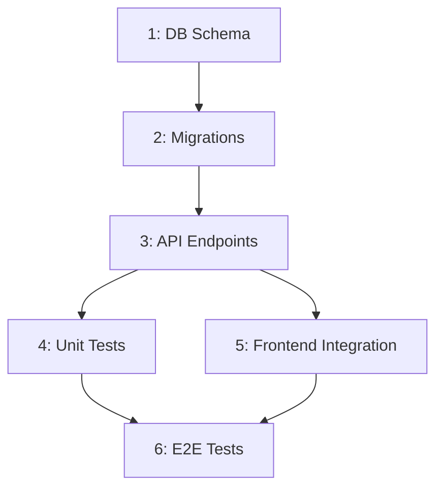

# /workflow - Implementation Plan Generator

> Generates **structured implementation plans** from PRDs, feature specs, and design docs. Planning only — does NOT execute. For execution, use `/sc:task` or `/sc:spawn`. For ad-hoc routing, PM Agent handles automatically.

## When to Use

**Use this command when you need to:**
- Break down a PRD or feature spec into ordered implementation steps
- Map dependencies between tasks before starting development
- Generate a roadmap that multiple developers (or agents) can follow
- Identify which `/sc:` commands apply to each implementation phase
- Estimate complexity and risk per step before committing to work
- Plan a multi-sprint or multi-phase feature rollout

**Do NOT use this command for:**
- Executing implementation tasks → use `/sc:task` or `/sc:spawn`
- Designing architecture or APIs → use `/sc:design` first, then workflow
- Analyzing existing code quality → use `/sc:analyze`
- Ad-hoc task routing → `/sc:pm` handles this automatically
- Single-step tasks that don't need planning → just use `/sc:task` directly

## Usage
```
/sc:workflow [prd-file|feature-description] [--strategy systematic|agile|incremental] [--depth shallow|normal|deep]
```

## Behavioral Flow

### 1. Parse Requirements (15-20% effort)
**What it reads:**
- PRD files, feature specs, design docs (Read)
- Existing codebase structure for context (Serena symbols overview, Glob)
- Related tests and acceptance criteria
- Existing implementation patterns in the project

**What it extracts:**
- Functional requirements (user stories, acceptance criteria)
- Non-functional requirements (performance, security, accessibility)
- Integration points with existing systems
- Assumptions and constraints

### 2. Analyze Dependencies (15-20% effort)
**Uses Sequential Thinking MCP for:**
- Decomposing complex features into independent work streams
- Identifying critical path and parallel execution opportunities
- Mapping data dependencies (which step needs output from which)
- Detecting circular dependencies or missing prerequisites

**Dependency types tracked:**
| Type | Example | Impact |
|------|---------|--------|
| **Data** | "API must exist before frontend can consume it" | Strict ordering |
| **Schema** | "DB migration must run before new queries" | Blocks deployment |
| **Interface** | "Type definitions needed before implementation" | Can stub/mock |
| **Test** | "Unit tests after implementation, E2E after integration" | Flexible ordering |

### 3. Generate Plan (40-50% effort)
**For each step, defines:**
- Clear deliverable (what is "done" for this step)
- Recommended `/sc:` command to execute it
- Technical domain (backend, frontend, database, infra, etc.)
- Dependencies (which steps must complete first)
- Estimated complexity (Low/Medium/High) with reasoning
- Risk flags (new technology, external dependency, data migration, etc.)
- Acceptance criteria specific to this step

**Strategy modes:**
| Strategy | Best For | Characteristics |
|----------|----------|-----------------|
| `systematic` | Large features, strict requirements | Full dependency analysis, comprehensive steps, risk assessment |
| `agile` | Iterative delivery, MVP-first | Prioritizes shippable increments, identifies MVP scope |
| `incremental` | Existing system enhancement | Preserves backwards compatibility, phased rollout, feature flags |

### 4. Validate Completeness (10-15% effort)
- Cross-reference plan steps against ALL original requirements
- Verify every acceptance criterion is covered by at least one step
- Check for orphaned dependencies (steps that nothing depends on and produce no user value)
- Identify missing steps: tests, documentation, deployment, monitoring

### 5. Output Plan (5-10% effort)
- Generate structured markdown document
- Optionally persist to Serena memory for cross-session access
- Include visual dependency graph (Mermaid)

## Output Structure

```markdown
# Implementation Workflow: [Feature Name]
Source: [PRD file or description]
Strategy: [systematic|agile|incremental]
Generated: [timestamp]

## Requirements Summary
- **Functional**: [bullet list extracted from PRD]
- **Non-functional**: [performance, security, etc.]
- **Out of scope**: [explicitly excluded items]

## Implementation Steps

### Phase 1: Foundation
| # | Step | Command | Domain | Depends On | Complexity | Risk |
|---|------|---------|--------|------------|------------|------|
| 1 | Define DB schema | `/sc:design --type database` | database | - | Medium | Low |
| 2 | Create migrations | `/sc:implement` | database | 1 | Low | Low |

### Phase 2: Core Logic
| # | Step | Command | Domain | Depends On | Complexity | Risk |
|---|------|---------|--------|------------|------------|------|
| 3 | Implement API endpoints | `/sc:implement` | backend | 2 | High | Medium |
| 4 | Add unit tests | `/sc:test` | backend | 3 | Medium | Low |

### Phase N: Polish & Deploy
...

## Dependency Graph


## Risk Register
| Risk | Steps Affected | Mitigation |
|------|---------------|------------|
| [risk description] | [step numbers] | [mitigation strategy] |

## Execution Recommendations
- Steps [X, Y] can run in parallel → consider `/sc:spawn`
- Step [Z] is highest risk → suggest `/sc:research` first
- MVP deliverable after step [N]
```

## Tool Coordination

| Tool | Purpose |
|------|---------|
| **Read** | Parse PRD files, feature specs, existing code |
| **Serena** | Understand existing architecture via symbols; persist plans across sessions |
| **Context7** | Framework-specific implementation patterns |
| **Sequential Thinking** | Complex dependency decomposition and critical path analysis |
| **Glob/Grep** | Discover existing patterns and related implementations |
| **Write** | Generate plan document |

## Differentiation from Related Commands

| Command | Scope | Use When |
|---------|-------|----------|
| `/sc:workflow` | Planning from PRD/spec | "Plan implementation of this feature spec" |
| `/sc:design` | Architecture/API/schema design | "Design the architecture before planning implementation" |
| `/sc:task` | Single task execution | "Execute this specific task now" |
| `/sc:spawn` | Parallel multi-domain execution | "Execute these independent domains in parallel" |
| `/sc:pm` | Always-on routing layer | Automatic — routes to the above |

**Typical flow:** `/sc:design` (architecture) → `/sc:workflow` (plan) → `/sc:task`/`/sc:spawn` (execute)

## Examples

### Deep PRD Workflow
```
/sc:workflow docs/PRD/auth-feature.md --strategy systematic --depth deep
# Reads full PRD → extracts all requirements and acceptance criteria
# Maps dependencies between auth components (DB, API, middleware, UI)
# Generates phased plan with Mermaid dependency graph
# Flags: "OAuth provider integration" as external dependency risk
# Suggests: /sc:research for OAuth best practices before step 3
```

### Agile MVP Plan
```
/sc:workflow "add user profile editing with avatar upload" --strategy agile --depth normal
# Identifies MVP: text fields first, avatar upload as enhancement
# Phase 1: DB schema + API (3 steps)
# Phase 2: Frontend form (2 steps)
# Phase 3: Avatar upload with storage (3 steps, flagged as higher risk)
# Parallel opportunities: frontend can start with mocked API
```

### Quick Feature Plan
```
/sc:workflow "add email notifications for order status changes" --depth shallow
# Lightweight: 5-7 key steps with dependencies
# Identifies: existing notification patterns to follow
# Output: single-page plan, no Mermaid diagram
```

### Incremental Migration Plan
```
/sc:workflow "migrate user auth from sessions to JWT" --strategy incremental
# Phase 1: Add JWT alongside sessions (backwards compatible)
# Phase 2: Migrate endpoints one by one
# Phase 3: Remove session support
# Each phase is independently deployable
# Rollback plan included per phase
```

## Boundaries

**Will:**
- Generate comprehensive implementation plans from PRDs, specs, and design docs
- Map dependencies and suggest `/sc:` commands for each step
- Identify parallelization opportunities and critical path
- Flag risks and suggest mitigations
- Persist plans in Serena for cross-session access
- Generate Mermaid dependency graphs

**Will Not:**
- Execute implementation tasks (use `/sc:task` or `/sc:spawn`)
- Design architecture or APIs (use `/sc:design` first)
- Replace domain-specific analysis (use `/sc:analyze`)
- Generate plans without reading the actual requirements first
- Make technology choices — it plans around existing stack decisions
