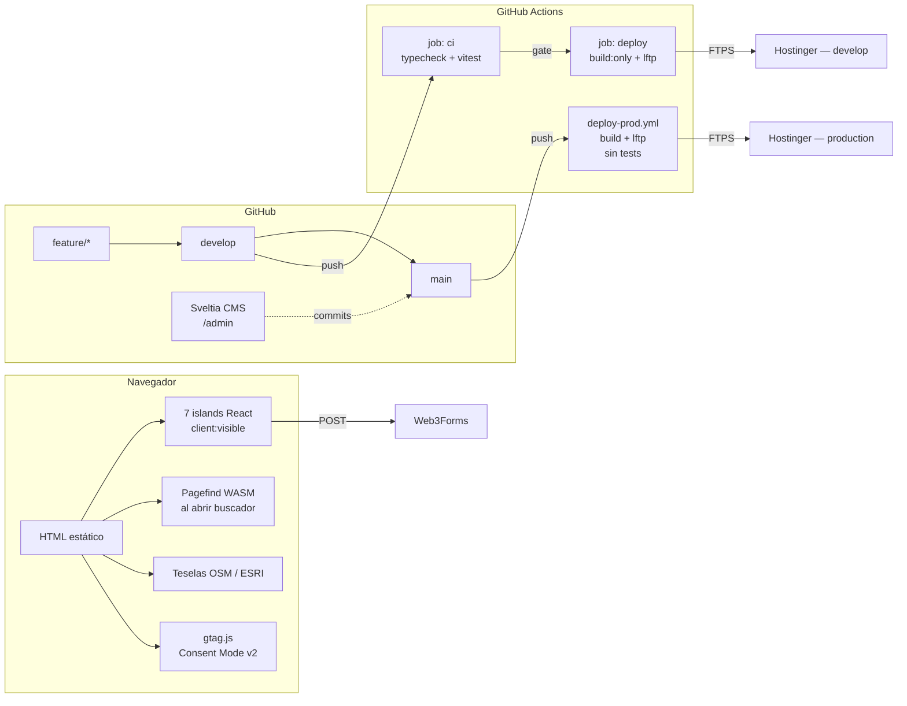

# Arquitectura Técnica — Club Deportivo Trocha y Ruta

**Reescrito**: 2026-09-09, reemplazando la versión de marzo de 2026 (~70 % obsoleta:
Cloudflare Pages, Keystatic, Umami y Astro 5 nunca se aplicaron o se abandonaron).
El original queda en el historial de git si hace falta consultarlo.

> **Regla de precedencia**: este documento explica *por qué* se tomó cada decisión.
> El *qué* — versiones exactas, dependencias, scripts — lo define siempre
> `package.json`, `astro.config.mjs` y `.github/workflows/`. Si algo de aquí
> contradice esos archivos, mandan ellos.

## 1. Qué corre hoy

**Astro 7** (`output: 'static'`), **Tailwind 4** vía el plugin de Vite (sin
`tailwind.config`, tokens en `@theme {}` de `global.css`), **React 19** en seis
islands de `src/components/interactive/` — todas `client:visible`, ninguna
`client:load` — más el island de mapa de `/la-pista`
(`TrackMapInteractive`, siete en total). **Sveltia CMS** en `/admin`, cargado
desde unpkg. **Pagefind** indexa `dist/` al final del build. **Vitest 4** con
dos proyectos (`astro` en node, `react` en jsdom). Node ≥ 22.12.

`typescript` está fijado en `^5.7.3` a propósito: `@astrojs/check` depende de la
API vieja del Language Service, que TypeScript 7 eliminó. Subir requiere que
Astro actualice esa dependencia primero.

## 2. Diagrama de arquitectura

## 3. Flujo de ramas y entornos

`feature/*` → `develop` (QA) → `main` (producción). Los dos workflows suben a
Hostinger por FTPS con **lftp** (`mirror --reverse --only-newer`, `deploy.yml` y
`deploy-prod.yml`): `FTP-Deploy-Action` fallaba con `ECONNRESET` en subidas
masivas contra Hostinger.

- **`deploy.yml`** (push a `develop`): el job `ci` (`astro check` + `npm test`)
  es gate del job `deploy` (`build:only` + lftp, environment `develop`).
- **`deploy-prod.yml`** (push a `main`): `npm run build` + lftp, environment
  `production`, **sin tests** — se asume que ya pasaron en `develop`.
- Las `PUBLIC_*` (`PUBLIC_WEB3FORMS_KEY`, `PUBLIC_GA4_MEASUREMENT_ID`,
  `PUBLIC_CLOUDINARY_CLOUD_NAME`) son *Variables* del Environment, no Secrets:
  su valor ya queda visible en el HTML del cliente. `FTP_SERVER` /
  `FTP_USERNAME` / `FTP_PASSWORD` sí son Secrets.

## 4. Presupuesto de rendimiento y accesibilidad

| Métrica | Objetivo | Cómo se verifica hoy |
|---|---|---|
| Lighthouse Performance | ≥ 95 | **A mano** — no hay Lighthouse CI en el repo |
| LCP | < 2.0 s | A mano |
| INP | < 200 ms | A mano |
| CLS | < 0.05 | A mano |
| WCAG | 2.1 AA | `vitest-axe` en tests de islands + revisión manual |

No automatizar Lighthouse es una decisión pendiente, no un hueco silencioso:
después del subsetting de fuentes de agosto de 2026 (ver §6) no se volvió a
medir. Si se retoma, es la tarea 14 de `docs/06-plan-animaciones.md`.

## 5. ADRs

### ADR-001 — CMS: Sveltia, no Decap ni Keystatic

**Vigente.** Decap CMS fue el candidato inicial, pero Netlify lo abandonó sin
dar nuevas features. Keystatic quedó descartado porque su panel de administración
exige un adaptador de servidor (render híbrido), incompatible con
`output: 'static'`. Sveltia CMS es una reescritura de Decap con UI moderna y
compatible con el mismo formato de `config.yml`: se carga desde unpkg, sin
paso de build, con backend `github` directo (`Club-Deportivo-Trocha-y-Ruta/main-page`,
rama `main`, `editorial_workflow`) — sin OAuth intermedio de Netlify Identity
ni Cloudflare Access, que era el plan original.

### ADR-002 — Imágenes: `astro:assets`, Cloudinary sin aplicar

**Mitad vigente.** `astro:assets` + Sharp cubre `src/assets/images/` (también
`media_folder` del CMS) para fotos de árboles, especies, logos y patrocinadores.
La mitad Cloudinary de la propuesta original **nunca se implementó**: cero URLs
`res.cloudinary.com` en el contenido, `astro-cloudinary` no está instalado. Las
fotos de crónicas, álbumes y logos van por ruta pública
(`public/images/{news,sponsors,trocha-verde}/`), fuera de `astro:assets`.

Quedan cuatro rastros de la integración que no llegó a usarse:
`image.domains` en `astro.config.mjs`, el `preconnect` de `BaseLayout.astro`,
`img-src` en `public/.htaccess` y `PUBLIC_CLOUDINARY_CLOUD_NAME` en
`.env.example` y en los dos workflows. Ninguno estorba, pero tampoco hace nada:
decidir si se completa la integración o se limpia el rastro es trabajo
pendiente, no urgente mientras el peso de imágenes siga dentro de presupuesto.

### ADR-003 — Formularios: Web3Forms

**Vigente.** `ContactForm.tsx` e `InscriptionForm.tsx` envían a Web3Forms con
`PUBLIC_WEB3FORMS_KEY` (vía `astro:env/client`). Se eligió por su plan gratuito
de 250 envíos/mes, honeypot incluido y ningún lock-in de hosting — a diferencia
de Netlify Forms, descartado por su cambio a facturación por créditos.

### ADR-004 — Analytics: GA4, no Cloudflare ni Umami

**Superada por decisión posterior, y documentada mejor en `CLAUDE.md`.** El
plan original evaluaba Cloudflare Web Analytics y Umami; ninguno llegó a
instalarse. El sitio corre con GA4: `gtag.js` en el hilo principal con `async`,
catálogo cerrado de eventos en `src/lib/events.ts`, interfaz neutral en
`src/lib/analytics.ts`, provider en `src/lib/analytics/providers/ga4.ts`,
Consent Mode v2 con default `denied` antes de cargar `gtag`. El 12 de agosto de
2026 el sitio pasó dos semanas sin medir nada porque Partytown descartaba los
atributos `src`/`async` del script — de ahí la regla de no volver a Partytown,
fijada por `Analytics.astro.test.ts`.

### ADR-005 — Hosting: Hostinger por FTPS, no Cloudflare Pages

**Superada.** Se descartó Vercel (el plan Hobby prohíbe uso comercial) y
Netlify (facturación por créditos). El club ya tenía hosting compartido en
Hostinger; el deploy sube por FTPS con lftp en vez de `FTP-Deploy-Action` (ver
§3). `netlify.toml`, `wrangler.toml` y `workers/donations/` son restos de la
evaluación de Cloudflare Pages, sin uso.

### ADR-006 — Pagefind como buscador estático

**Vigente, sin ADR previa que la registrara.** `pagefind --site dist` indexa
el build al final de `npm run build`. `SiteSearch.tsx` descarga el índice WASM
solo al abrir el diálogo de búsqueda, no en la carga inicial. Requiere
`'wasm-unsafe-eval'` en la CSP de `public/.htaccess`.

## 6. Historia: la fuente que nunca fue una fuente

`PlusJakartaSans-Variable.woff2` eran, hasta agosto de 2026, 305 KB de la
página HTML de error 404 de GitHub guardada con extensión `.woff2` (`file` la
reportaba como «HTML document text»). El sitio la precargaba en las 143 páginas
del build y los títulos se pintaban con el `system-ui` del fallback, sin ningún
error visible en consola. Se reemplazó por la variable real de `google/fonts` y
se aplicó `pyftsubset` (Latin + Latin-1 + puntuación española) a las dos
familias: 657 KB → 160 KB (−76 %). El rango latino estándar no bastaba para el
contenido real del sitio — un barrido del HTML construido encontró `→` (81
veces), `▲`/`▼` (36, tablas de resultados) y `★` (4, crónicas) — así que están
sumados a mano al `unicode-range` de `global.css`, que debe coincidir con
`$UNICODES` de `scripts/subset-fonts.sh` (verificado por `src/test/fonts.test.ts`).

## 7. Restos y deuda declarada

- **`netlify.toml`, `wrangler.toml`, `workers/donations/`** (con un
  `node_modules/` completo versionado): restos de la evaluación de Cloudflare
  Pages / Netlify. Sin uso, sin plan de retomarlos.
- **Rastro de Cloudinary** sin integración completa (ver ADR-002).
- **`typescript` fijado en 5.7.3** por incompatibilidad de `@astrojs/check`
  con TypeScript 7.
- **Sin Lighthouse CI**: el presupuesto de rendimiento se verifica a mano.
- Bugs de tooling que no son arquitectura pero sí cuestan tiempo si se
  olvidan: ver `docs/09-deuda-de-tooling.md`.

## Referencias

- `CLAUDE.md` — operación diaria: comandos, stack, convenciones.
- `docs/04-sistema-editorial.md` — sistema de componentes de UI.
- `docs/03-content-strategy.md` — colecciones, taxonomía, SEO estructural.
