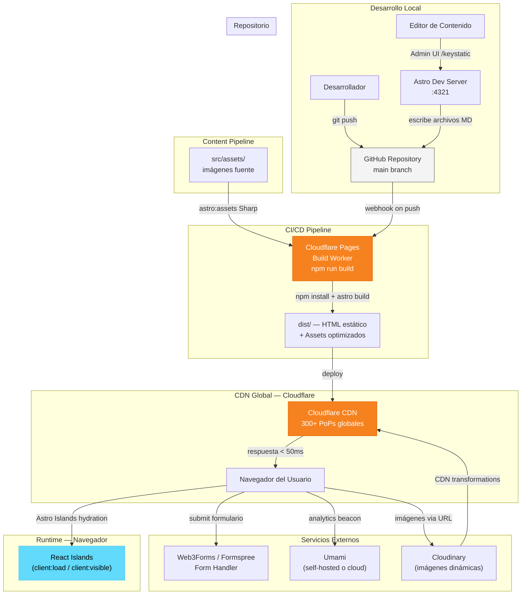

# Arquitectura Técnica — Club Deportivo Trocha y Ruta

**Versión**: 1.0
**Fecha**: Marzo 2026
**Responsable**: System Architect

---

## 1. Validación del Stack

### 1.1 Astro

| Aspecto | Propuesto | Validado |
|---------|-----------|---------|
| Versión | 5.x | **Astro 5.x es estable** — la última versión de la rama 5 es 5.17+. Astro 6 existe en npm (6.0.6) pero fue publicado hace horas y no es recomendable para un proyecto nuevo en marzo 2026 sin validar breaking changes. |
| Versión recomendada | — | `^5.17.0` |
| Decisión | Usar Astro 5.x | Confirmado. La rama 5 es madura, con Content Collections v2, Server Islands y View Transitions estables. Astro 6 queda pendiente de evaluar cuando salga de su fase inicial. |

**Cambio respecto al PROMPT**: Se recomienda fijar `^5.17.0` en lugar de `5.x` genérico para evitar saltos inesperados a v6.

### 1.2 Tailwind CSS

| Aspecto | Propuesto | Validado |
|---------|-----------|---------|
| Versión | 4.x | **Tailwind CSS 4.x es estable** (lanzado enero 2025, ahora en 4.1+). Compatibilidad oficial con Astro 5.2+ mediante plugin Vite nativo. |
| Integración | `@astrojs/tailwind` | **Cambio arquitectónico importante**: En Tailwind 4 ya NO se usa el integration de Astro (`@astrojs/tailwind`). Se usa el **Vite plugin** de Tailwind directamente. La configuración pasa de `tailwind.config.mjs` a directivas CSS `@theme` en el archivo CSS global. |
| Versión recomendada | — | `^4.1.0` |

**Impacto en archivos de configuración**: `tailwind.config.mjs` desaparece como archivo de configuración separado. Los design tokens se definen en `src/styles/global.css` usando `@theme {}`.

### 1.3 Decap CMS

| Aspecto | Estado |
|---------|--------|
| Mantenimiento | Netlify **abandonó oficialmente el soporte**. El proyecto tiene actividad comunitaria reducida. No recibe nuevas features. |
| UI | Desactualizada respecto a alternativas modernas. |
| Alternativa principal | **Keystatic** — mantenido activamente por Thinkmill, integración oficial con Astro (`docs.astro.build`), TypeScript nativo, schemas definidos en código. |
| Alternativa secundaria | **Sveltia CMS** — reescritura moderna de Decap con mejor performance y UI actualizada, compatible con la misma `config.yml` de Decap. |
| Recomendación | Ver ADR-001 |

**Nota crítica**: Keystatic requiere un adaptador de servidor Astro para su Admin UI, lo que implica deploy en modo SSR parcial (hybrid rendering). Sveltia CMS mantiene compatibilidad con la config de Decap y funciona en modo completamente estático.

### 1.4 React como Islands Architecture

| Aspecto | Validado |
|---------|---------|
| Versión | React **19.2.4** (enero 2026, última estable) |
| Integración Astro | `@astrojs/react` con soporte completo para React 19 |
| Uso correcto en el proyecto | Limitado a componentes interactivos: `ContactForm.tsx`, `InscriptionForm.tsx`, `ImageLightbox.tsx`, `MobileMenu.tsx`, `Carousel.tsx` |
| Directivas de carga | `client:load` para críticos (nav mobile), `client:visible` para defer (carrusel, lightbox) |

### 1.5 Hosting

Según la investigación de 2026, **Cloudflare Pages** emerge como la mejor opción para sitios estáticos con:
- Ancho de banda **ilimitado y gratuito**
- CDN global con 300+ PoPs
- Builds ilimitados en free tier
- Sin restricciones de uso comercial (a diferencia de Vercel Hobby)

Ver ADR-005 para análisis completo.

---

## 2. Diagrama de Arquitectura



### Flujo Git

```
feature/xxx  →  main  →  [Cloudflare Pages build automático]  →  producción
```

Para contenido vía CMS:
```
Editor en /keystatic  →  commit automático  →  main  →  rebuild  →  producción
```

---

## 3. Mapa de Dependencias

### 3.1 Core Dependencies

| Paquete | Versión | Propósito |
|---------|---------|-----------|
| `astro` | `^5.17.0` | Framework principal SSG |
| `@astrojs/react` | `^4.2.0` | Integration React Islands |
| `@astrojs/sitemap` | `^3.4.0` | Generación automática sitemap XML |
| `react` | `^19.2.4` | UI library para Islands |
| `react-dom` | `^19.2.4` | React DOM renderer |
| `@tailwindcss/vite` | `^4.1.0` | Plugin Vite de Tailwind CSS 4 |
| `tailwindcss` | `^4.1.0` | Framework de estilos utility-first |
| `sharp` | `^0.33.5` | Procesamiento de imágenes en build |

### 3.2 UI y Componentes Interactivos

| Paquete | Versión | Propósito |
|---------|---------|-----------|
| `astro-icon` | `^1.1.4` | Sistema de iconos SVG (tree-shakeable) |
| `@phosphor-icons/core` | `^2.1.1` | Set de iconos Phosphor |
| `swiper` | `^11.1.0` | Carrusel para `Carousel.tsx` |
| `yet-another-react-lightbox` | `^3.21.0` | Lightbox para galería |
| `@formkit/auto-animate` | `^0.8.2` | Animaciones de lista sin JS pesado |

### 3.3 CMS y Contenido

| Paquete | Versión | Propósito |
|---------|---------|-----------|
| `@keystatic/core` | `^0.5.35` | CMS Keystatic core |
| `@keystatic/astro` | `^5.0.5` | Integration Keystatic para Astro |

> **Nota**: Si se selecciona Sveltia CMS (ADR-001), no se instala ningún paquete npm — el CMS se carga desde CDN como script en `public/admin/index.html`.

### 3.4 Formularios

| Paquete | Versión | Propósito |
|---------|---------|-----------|
| `react-hook-form` | `^7.53.2` | Gestión de estado de formularios |
| `zod` | `^3.23.8` | Validación de esquemas (compartido con Content Collections) |
| `@hookform/resolvers` | `^3.9.3` | Resolver Zod para react-hook-form |

### 3.5 Dev Dependencies

| Paquete | Versión | Propósito |
|---------|---------|-----------|
| `typescript` | `^5.7.3` | Tipado estático |
| `@types/react` | `^19.0.8` | Tipos TypeScript para React 19 |
| `@types/react-dom` | `^19.0.3` | Tipos TypeScript para React DOM |
| `eslint` | `^9.19.0` | Linting de código |
| `eslint-plugin-astro` | `^1.3.1` | Reglas ESLint específicas para Astro |
| `@typescript-eslint/eslint-plugin` | `^8.21.0` | Reglas ESLint TypeScript |
| `@typescript-eslint/parser` | `^8.21.0` | Parser TypeScript para ESLint |
| `prettier` | `^3.4.2` | Formateo de código |
| `prettier-plugin-astro` | `^0.14.1` | Formateo de archivos `.astro` |
| `prettier-plugin-tailwindcss` | `^0.6.9` | Ordenamiento de clases Tailwind |
| `@astrojs/check` | `^0.9.4` | Type-checking Astro |

---

## 4. Archivos de Configuración

### 4.1 `package.json`

```json
{
  "name": "trocha-y-ruta",
  "version": "1.0.0",
  "private": true,
  "scripts": {
    "dev": "astro dev",
    "build": "astro check && astro build",
    "preview": "astro preview",
    "lint": "eslint src --ext .ts,.tsx,.astro",
    "lint:fix": "eslint src --ext .ts,.tsx,.astro --fix",
    "format": "prettier --write \"src/**/*.{astro,ts,tsx,css,md}\"",
    "format:check": "prettier --check \"src/**/*.{astro,ts,tsx,css,md}\"",
    "typecheck": "astro check"
  },
  "dependencies": {
    "@astrojs/react": "^4.2.0",
    "@astrojs/sitemap": "^3.4.0",
    "@formkit/auto-animate": "^0.8.2",
    "@hookform/resolvers": "^3.9.3",
    "@keystatic/astro": "^5.0.5",
    "@keystatic/core": "^0.5.35",
    "@phosphor-icons/core": "^2.1.1",
    "@tailwindcss/vite": "^4.1.0",
    "astro": "^5.17.0",
    "astro-icon": "^1.1.4",
    "react": "^19.2.4",
    "react-dom": "^19.2.4",
    "react-hook-form": "^7.53.2",
    "sharp": "^0.33.5",
    "swiper": "^11.1.0",
    "tailwindcss": "^4.1.0",
    "yet-another-react-lightbox": "^3.21.0",
    "zod": "^3.23.8"
  },
  "devDependencies": {
    "@astrojs/check": "^0.9.4",
    "@types/react": "^19.0.8",
    "@types/react-dom": "^19.0.3",
    "@typescript-eslint/eslint-plugin": "^8.21.0",
    "@typescript-eslint/parser": "^8.21.0",
    "eslint": "^9.19.0",
    "eslint-plugin-astro": "^1.3.1",
    "prettier": "^3.4.2",
    "prettier-plugin-astro": "^0.14.1",
    "prettier-plugin-tailwindcss": "^0.6.9",
    "typescript": "^5.7.3"
  },
  "engines": {
    "node": ">=20.0.0"
  }
}
```

### 4.2 `astro.config.mjs`

```javascript
import { defineConfig } from 'astro/config';
import react from '@astrojs/react';
import sitemap from '@astrojs/sitemap';
import tailwindcss from '@tailwindcss/vite';
import icon from 'astro-icon';
// Descomentar si se usa Keystatic como CMS:
// import keystatic from '@keystatic/astro';

export default defineConfig({
  site: 'https://clubdeportivotrochayruta.org',

  integrations: [
    react(),
    sitemap({
      // Excluir rutas administrativas
      filter: (page) => !page.includes('/keystatic'),
    }),
    icon({
      include: {
        ph: ['*'], // Phosphor Icons
      },
    }),
    // Descomentar si se usa Keystatic:
    // keystatic(),
  ],

  vite: {
    plugins: [tailwindcss()],
  },

  image: {
    // Dominios externos permitidos para optimización de imágenes
    domains: ['res.cloudinary.com'],
    // Formatos de salida preferidos
    experimentalLayout: 'responsive',
  },

  // Habilitar View Transitions nativas de Astro
  // (se activa en cada layout con <ViewTransitions />)

  // Para Keystatic con SSR híbrido, descomentar:
  // output: 'hybrid',
  // adapter: cloudflare(),

  // Por defecto: generación completamente estática
  output: 'static',
});
```

### 4.3 `src/styles/global.css` (Tailwind 4 — Design Tokens via `@theme`)

> En Tailwind 4, `tailwind.config.mjs` ya no existe. Los design tokens se definen directamente en CSS.

```css
@import "tailwindcss";

@theme {
  /* Colores de marca */
  --color-primary: #046bd2;
  --color-primary-dark: #0356a8;
  --color-primary-light: #3388e0;

  --color-accent: #ef4297;
  --color-accent-dark: #d6367f;
  --color-accent-light: #f468ad;

  --color-cyan: #03b7df;
  --color-cyan-dark: #029abc;
  --color-cyan-light: #2ec9ea;

  --color-surface: #ffffff;
  --color-surface-dark: #1a1a2e;
  --color-surface-muted: #f8fafc;

  --color-text-primary: #1e293b;
  --color-text-secondary: #64748b;

  /* Tipografía */
  --font-sans: 'Inter Variable', system-ui, sans-serif;
  --font-display: 'Plus Jakarta Sans', system-ui, sans-serif;

  /* Breakpoints (heredados de Tailwind, aquí documentados) */
  --breakpoint-sm: 640px;
  --breakpoint-md: 768px;
  --breakpoint-lg: 1024px;
  --breakpoint-xl: 1280px;
  --breakpoint-2xl: 1536px;
}

/* Fuentes locales */
@font-face {
  font-family: 'Inter Variable';
  src: url('/fonts/InterVariable.woff2') format('woff2');
  font-weight: 100 900;
  font-display: swap;
}

@font-face {
  font-family: 'Plus Jakarta Sans';
  src: url('/fonts/PlusJakartaSans-Variable.woff2') format('woff2');
  font-weight: 200 800;
  font-display: swap;
}

/* Base global */
@layer base {
  html {
    color: var(--color-text-primary);
    font-family: var(--font-sans);
    scroll-behavior: smooth;
  }

  h1, h2, h3, h4 {
    font-family: var(--font-display);
    font-weight: 700;
  }
}
```

> **Nota para el equipo**: El `tailwind.config.mjs` del PROMPT original se reemplaza completamente por este archivo CSS. No se necesita archivo de configuración JS separado en Tailwind 4.

### 4.4 `tsconfig.json`

```json
{
  "extends": "astro/tsconfigs/strict",
  "compilerOptions": {
    "target": "ES2022",
    "module": "ESNext",
    "moduleResolution": "Bundler",
    "allowImportingTsExtensions": true,
    "jsx": "react-jsx",
    "jsxImportSource": "react",
    "strict": true,
    "baseUrl": ".",
    "paths": {
      "@components/*": ["src/components/*"],
      "@layouts/*": ["src/layouts/*"],
      "@lib/*": ["src/lib/*"],
      "@assets/*": ["src/assets/*"],
      "@types/*": ["src/types/*"]
    }
  },
  "include": ["src/**/*.ts", "src/**/*.tsx", "src/**/*.astro"]
}
```

### 4.5 `netlify.toml`

> Se mantiene como configuración de respaldo dado que el ADR-005 recomienda Cloudflare Pages. Ambos pueden coexistir; Cloudflare Pages usa la misma lógica de build.

```toml
[build]
  command = "npm run build"
  publish = "dist"

[build.environment]
  NODE_VERSION = "20"

[[redirects]]
  from = "/admin"
  to = "/keystatic"
  status = 301

# Cabeceras de seguridad y caché
[[headers]]
  for = "/*"
  [headers.values]
    X-Frame-Options = "DENY"
    X-Content-Type-Options = "nosniff"
    Referrer-Policy = "strict-origin-when-cross-origin"
    Permissions-Policy = "camera=(), microphone=(), geolocation=()"

[[headers]]
  for = "/assets/*"
  [headers.values]
    Cache-Control = "public, max-age=31536000, immutable"

[[headers]]
  for = "*.html"
  [headers.values]
    Cache-Control = "public, max-age=0, must-revalidate"
```

### 4.6 `wrangler.toml` (para Cloudflare Pages — recomendado)

```toml
name = "trocha-y-ruta"
pages_build_output_dir = "dist"
compatibility_date = "2026-03-01"

[build]
command = "npm run build"
```

### 4.7 `.gitignore`

```gitignore
# Dependencias
node_modules/
.pnp
.pnp.js

# Astro
dist/
.astro/

# Entorno
.env
.env.local
.env.*.local

# Sistema operativo
.DS_Store
Thumbs.db

# Editores
.vscode/settings.json
.idea/
*.swp
*.swo

# Logs
npm-debug.log*
yarn-debug.log*
yarn-error.log*

# Netlify
.netlify/

# Caché
.cache/
```

### 4.8 `src/content/config.ts` (schemas Zod — sin cambios del PROMPT)

Los schemas definidos en el PROMPT son correctos y se mantienen sin modificación. Se confirma su compatibilidad con Astro 5 Content Collections v2.

---

## 5. Performance Budget

| Métrica | Target | Herramienta de medición | Notas |
|---------|--------|------------------------|-------|
| **LCP** (Largest Contentful Paint) | < 2.0s | Lighthouse / CrUX | Hero image con `fetchpriority="high"` y formato AVIF/WebP |
| **INP** (Interaction to Next Paint) | < 200ms | Lighthouse / CrUX | Reemplaza a FID en Lighthouse v11+. React Islands con `client:visible` minimiza JS en carga inicial |
| **CLS** (Cumulative Layout Shift) | < 0.05 | Lighthouse | `width`/`height` explícitos en todas las imágenes Astro |
| **FCP** (First Contentful Paint) | < 1.2s | Lighthouse | Fuentes con `font-display: swap`, CSS inline crítico |
| **TTFB** (Time to First Byte) | < 200ms | PageSpeed Insights | Resuelto por Cloudflare CDN; para Netlify similar |
| **JS Total (homepage)** | < 80KB gzipped | `astro build` output | Solo React Islands hidratados; resto es HTML puro |
| **CSS Total** | < 15KB gzipped | `astro build` output | Tailwind purge elimina clases no usadas |
| **Lighthouse Performance** | > 95 | Lighthouse CI | CI bloqueante en PRs |
| **Lighthouse Accessibility** | > 95 | Lighthouse CI | WCAG 2.1 AA mínimo |
| **Lighthouse SEO** | > 98 | Lighthouse CI | Sitemap, meta tags dinámicos, JSON-LD |
| **Lighthouse Best Practices** | > 95 | Lighthouse CI | HTTPS, sin librerías vulnerables |

### Estrategia de optimización de imágenes

```
Imágenes locales (src/assets/):
  → Astro <Image /> → Sharp → WebP/AVIF → CDN cache

Imágenes dinámicas del CMS (Cloudinary):
  → Cloudinary transformation URL → formato auto (f_auto) → calidad auto (q_auto)
  → Ejemplo: https://res.cloudinary.com/trocha/image/upload/f_auto,q_auto,w_800/riders/juan.jpg
```

---

## 6. Decisiones Arquitectónicas (ADRs)

---

### ADR-001: Selección de CMS

**Contexto**: El club necesita que editores no técnicos puedan gestionar noticias, eventos, corredores y patrocinadores sin tocar código. Decap CMS (propuesto originalmente) fue abandonado por Netlify y tiene mantenimiento reducido.

**Opciones Evaluadas**

| Opción | Pros | Contras | Riesgo |
|--------|------|---------|--------|
| **Decap CMS** | Sin dependencias npm, `config.yml` simple, amplia documentación | Netlify abandonó el soporte; UI obsoleta; sin nuevas features; comunidad en declive | Alto — dependencia de proyecto sin mantenedor activo |
| **Sveltia CMS** | Reescritura moderna de Decap, compatible con `config.yml` existente, 100% estático, sin npm | Proyecto más nuevo, menor ecosistema | Bajo-Medio |
| **Keystatic** | Mantenido por Thinkmill, TypeScript nativo, integración oficial con Astro, DX excelente | Requiere SSR híbrido (adaptador) para Admin UI; más complejo de configurar | Bajo — bien mantenido, respaldado por empresa |
| **TinaCMS** | Visual editing en tiempo real, Git-based | Requiere backend propio (Tina Cloud) o self-hosting; más costoso en configuración | Medio |

**Recomendación**: **Sveltia CMS** para la fase inicial del proyecto.

**Justificación**: Para un club deportivo comunitario con equipo técnico limitado, la prioridad es velocidad de setup y cero complejidad operacional. Sveltia CMS es completamente estático (sin adaptador SSR), su `config.yml` es compatible con el ecosistema de Decap (documentación existente), y tiene una UI significativamente más moderna. Se evalúa migración a Keystatic si el equipo técnico del club crece.

**Consecuencias**:
- La ruta `/admin` sirve el UI de Sveltia desde CDN (no hay código npm)
- El `public/admin/config.yml` define todos los schemas del CMS
- El archivo `src/content/config.ts` de Astro es la fuente de verdad de tipos; `config.yml` debe estar sincronizado manualmente
- Autenticación a través de GitHub OAuth (gratis via Netlify Identity o Cloudflare Access)

**Reversibilidad**: Alta. Si en 6 meses se decide migrar a Keystatic, el contenido (archivos `.md`) no cambia.

---

### ADR-002: Pipeline de Imágenes

**Contexto**: El sitio tendrá cientos de imágenes (fotos de corredores, eventos, galería). Se necesita optimización automática sin aumentar el tiempo de build ni el costo de infraestructura.

**Opciones Evaluadas**

| Opción | Pros | Contras | Riesgo |
|--------|------|---------|--------|
| **Astro nativo (`astro:assets`)** | Cero costo, integrado en el build, AVIF/WebP automático, lazy loading | Imágenes pesadas aumentan tiempo de build; no sirve transformaciones on-the-fly | Bajo |
| **Cloudinary** | Transformaciones on-the-fly, CDN propio, free tier generoso (25 créditos/mes), Video support | Dependencia de tercero; URLs largas | Bajo |
| **Híbrido: Astro para build + Cloudinary para CMS** | Mejor de ambos mundos: imágenes de código optimizadas en build, imágenes del CMS servidas por Cloudinary | Mayor complejidad conceptual para editores | Bajo-Medio |

**Recomendación**: **Enfoque híbrido**.

**Implementación**:
- `src/assets/` → Astro `<Image />` → Sharp en build → WebP/AVIF
- Imágenes del CMS (subidas por editores) → Cloudinary con `astro-cloudinary`
- La referencia en el contenido es solo el `public_id` de Cloudinary, no la URL completa

**Consecuencias**:
- Los desarrolladores usan `<Image src={import('./foto.jpg')} />` para imágenes de código
- Los editores del CMS ven un widget de upload de Cloudinary, no un campo de texto de URL
- Free tier de Cloudinary (25 créditos/mes) es suficiente para un club deportivo comunitario

**Reversibilidad**: Media. Si se quiere abandonar Cloudinary, las imágenes del CMS deben migrarse.

---

### ADR-003: Manejo de Formularios

**Contexto**: El sitio tiene dos formularios críticos: contacto general e inscripción al club (multi-paso). Necesitan spam protection, notificación por email y sin backend propio.

**Opciones Evaluadas**

| Opción | Pros | Contras | Riesgo |
|--------|------|---------|--------|
| **Netlify Forms** | Integrado con Netlify deploy, configuración mínima | Billing por créditos desde sep 2025 confuso; riesgo de pausa de cuenta por spike; lock-in a Netlify | Medio — plataforma cambia condiciones frecuentemente |
| **Formspree** | Battle-tested (desde 2013), confiable, 50 envíos/mes gratis | Caro si se escala ($10+/mes para 250 envíos) | Bajo |
| **Web3Forms** | 250 envíos/mes gratis, sin backend, CORS-friendly, honeypot built-in | Proyecto más nuevo, menor track record | Bajo-Medio |
| **Basin** | $8/mes plan base con custom redirects y autoresponders | Sin tier gratuito relevante para producción | Medio |

**Recomendación**: **Web3Forms** para el proyecto.

**Justificación**: 250 envíos/mes gratuitos cubre perfectamente un club deportivo comunitario. Sin restricciones de plataforma de hosting (funciona con Cloudflare Pages, Netlify, cualquier CDN). Honeypot spam protection incluido. Si se supera el free tier en el futuro, el costo es mínimo.

**Implementación en `ContactForm.tsx`**:
```typescript
// Envío a Web3Forms — sin backend propio
const response = await fetch('https://api.web3forms.com/submit', {
  method: 'POST',
  headers: { 'Content-Type': 'application/json' },
  body: JSON.stringify({
    access_key: import.meta.env.PUBLIC_WEB3FORMS_KEY,
    ...formData,
  }),
});
```

**Consecuencias**:
- Variable de entorno `PUBLIC_WEB3FORMS_KEY` necesaria en Cloudflare Pages y `.env.local`
- No hay lock-in de hosting

**Reversibilidad**: Alta. Cambiar el endpoint de submit en el componente React.

---

### ADR-004: Analytics

**Contexto**: El club quiere medir visitas al sitio sin comprometer la privacidad de los usuarios (muchos son menores de edad). Se requiere GDPR/COPPA compliance y sin cookies de seguimiento.

**Opciones Evaluadas**

| Opción | Pros | Contras | Riesgo |
|--------|------|---------|--------|
| **Plausible (cloud)** | Privacidad-first, GDPR, sin cookies, dashboard limpio | $9/mes para cloud; self-hosted requiere VPS con 2GB RAM mínimo; AGPL-3.0 con restricciones comerciales | Bajo |
| **Umami (cloud)** | MIT License, self-hosted en 512MB RAM, PostgreSQL/MySQL, API robusta, datos por ciudad | Self-hosted requiere mantenimiento de servidor | Bajo |
| **Vercel Analytics** | Integrado si se usa Vercel | Lock-in de plataforma; no aplica si se usa Cloudflare Pages | N/A |
| **Cloudflare Web Analytics** | Gratuito, sin cookies, incluido en Cloudflare Pages | Métricas limitadas, sin API de datos | Bajo |

**Recomendación**: **Cloudflare Web Analytics** como baseline (incluido gratis) + **Umami Cloud** (gratuito hasta 10K eventos/mes) para métricas avanzadas.

**Justificación**: Para un club deportivo comunitario, Cloudflare Web Analytics gratuito es suficiente para las métricas básicas (visitas, páginas vistas, países). Si se necesita tracking de formularios o eventos de conversión, Umami Cloud free tier cubre el caso de uso.

**Consecuencias**:
- Cero costo operacional para analytics
- Sin banner de cookies requerido
- Se agrega un script ligero de Umami en `SEOHead.astro` si se activa

**Reversibilidad**: Alta. El script de analytics se agrega o quita en un componente.

---

### ADR-005: Hosting y Deploy

**Contexto**: El sitio es completamente estático (SSG). Se necesita deploy automático desde Git, CDN global, dominio personalizado gratis, y sin restricciones de uso comercial (el club puede eventualmente vender inscripciones o recibir pagos de sponsors).

**Opciones Evaluadas**

| Opción | Pros | Contras | Riesgo |
|--------|------|---------|--------|
| **Netlify** | Amplia documentación con Astro, formularios integrados, funciones serverless | Billing por créditos confuso desde sep 2025; 100 min de build/mes en free tier (antes 300); Netlify Forms complicado | Medio — cambios frecuentes de condiciones |
| **Vercel** | Excelente DX, preview deployments, Edge Network global | Hobby plan **prohibido para uso comercial**; cualquier sitio con ingresos requiere Pro ($20/mes) | Alto — restricción de licencia |
| **Cloudflare Pages** | Bandwidth **ilimitado y gratuito**, 300+ PoPs, builds ilimitados, sin restricción comercial, compatible con Workers | Menor ecosistema de integraciones que Netlify; formularios no incluidos | Bajo |

**Recomendación**: **Cloudflare Pages**.

**Justificación**: Para un sitio estático de un club deportivo, Cloudflare Pages ofrece el mejor valor: sin restricciones comerciales, bandwidth ilimitado (fundamental si la galería de fotos recibe tráfico), builds ilimitados, y la CDN más grande del mundo con más de 300 puntos de presencia. El free tier de Vercel prohíbe explícitamente el uso comercial, lo que representa un riesgo legal inaceptable incluso para un club comunitario.

**Consecuencias**:
- Se usa `wrangler.toml` en lugar de `netlify.toml` como configuración principal
- Los formularios se manejan con Web3Forms (ADR-003), no con Cloudflare nativo
- Las variables de entorno se configuran en el dashboard de Cloudflare Pages

**Reversibilidad**: Media. Cambiar de CDN de hosting es posible, pero requiere reconfigurar DNS, variables de entorno y webhooks de deploy.

---

## 7. Resumen de Decisiones y Stack Final Confirmado

| Capa | Tecnología | Versión | Estado |
|------|-----------|---------|--------|
| Framework | Astro | `^5.17.0` | Confirmado (se retrasa adopción de v6) |
| Estilos | Tailwind CSS 4 + Vite plugin | `^4.1.0` | Confirmado — sin `tailwind.config.mjs` |
| React Islands | React | `^19.2.4` | Confirmado |
| CMS | **Sveltia CMS** | CDN | **Cambio**: reemplaza a Decap CMS |
| Imágenes | Astro native + Cloudinary | — | Confirmado — enfoque híbrido |
| Formularios | **Web3Forms** | HTTP API | **Cambio**: reemplaza a Netlify Forms |
| Deploy/CDN | **Cloudflare Pages** | — | **Cambio**: reemplaza a Netlify como opción principal |
| Analytics | Cloudflare Web Analytics + Umami | — | **Cambio**: Cloudflare primario, Umami secundario |
| Iconos | astro-icon + Phosphor Icons | `^1.1.4` | Confirmado |
| Animaciones | CSS + View Transitions API | Nativo | Confirmado |

---

## 8. Notas de Implementación para el Equipo

### Para el Frontend Developer

1. **Tailwind 4**: No uses `tailwind.config.mjs`. Los tokens están en `src/styles/global.css` bajo `@theme {}`. Para usar colores: `bg-primary` / `text-accent` / `border-cyan` (Tailwind 4 genera clases desde las variables `--color-*`).

2. **React Islands**: Usa `client:visible` por defecto para diferir la hidratación. Reserva `client:load` solo para componentes críticos al LCP (ej: `MobileMenu.tsx` en mobile).

3. **Imágenes**: Siempre usa `<Image>` de `astro:assets` para imágenes locales. Para imágenes del CMS (Cloudinary), usa el componente `CldImage` de `astro-cloudinary`.

4. **View Transitions**: Agrega `<ViewTransitions />` en `BaseLayout.astro`. Es compatible con React Islands en Astro 5.

### Para el Content Developer

1. **CMS URL local**: Con Sveltia CMS, el admin está en `http://localhost:4321/admin` (sirve `public/admin/index.html`).

2. **Sincronización**: El `public/admin/config.yml` DEBE reflejar los mismos campos que `src/content/config.ts`. Son fuentes independientes — Astro no lee el YML del CMS.

3. **Schemas Zod en Content Collections**: Los schemas del PROMPT son compatibles con Astro 5. Usar `z.string().url()` para campos de URL de imágenes de Cloudinary.

### Para todos

- Node.js >= 20 requerido (ver `engines` en `package.json`).
- Variables de entorno necesarias: `PUBLIC_WEB3FORMS_KEY`, `PUBLIC_CLOUDINARY_CLOUD_NAME`.
- Comando de build en CI: `npm run build` (incluye `astro check` para type-checking).

---

*Fuentes consultadas:*
- [Astro Releases — GitHub](https://github.com/withastro/astro/releases)
- [Tailwind CSS v4 + Astro Setup — Tailkits](https://tailkits.com/blog/astro-tailwind-setup/)
- [Keystatic + Astro — Docs oficiales](https://docs.astro.build/en/guides/cms/keystatic/)
- [Netlify Forms alternatives 2026 — DEV Community](https://dev.to/allenarduino/netlify-forms-is-getting-expensive-here-are-the-best-alternatives-in-2026-3a7k)
- [Cloudflare vs Vercel vs Netlify 2026 — DEV Community](https://dev.to/dataformathub/cloudflare-vs-vercel-vs-netlify-the-truth-about-edge-performance-2026-50h0)
- [Plausible vs Umami 2026 — SelfHostWise](https://selfhostwise.com/posts/self-hosted-website-analytics-in-2026-umami-vs-plausible-complete-guide/)
- [React 19.2 Release — React Blog](https://react.dev/blog/2025/10/01/react-19-2)
- [Decap CMS alternatives 2026 — Sitepins](https://sitepins.com/blog/decapcms-alternatives)
