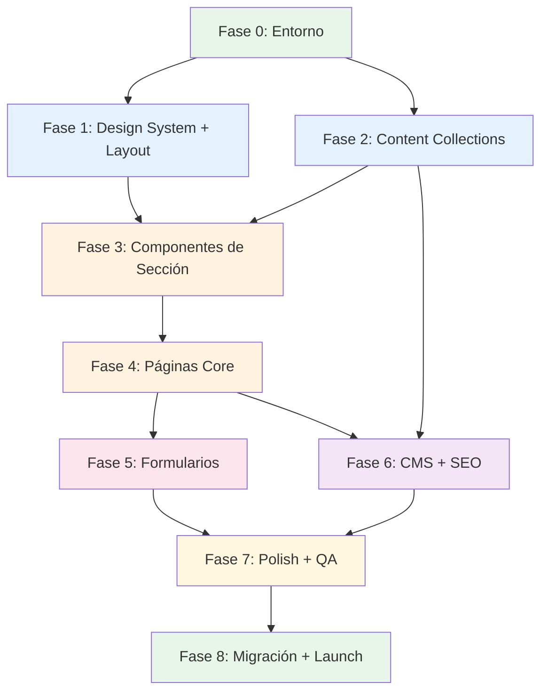
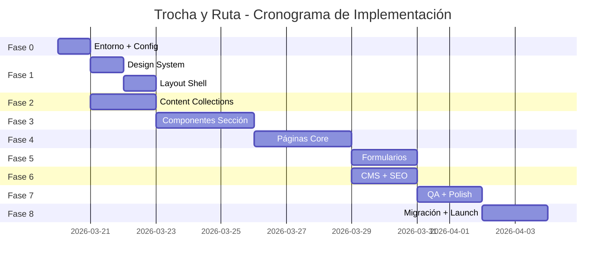

# Workflow de Implementación: Trocha y Ruta

> Generado por PM Agent | Fecha: 2026-03-19 | Actualizado: 2026-03-19
> Estrategia: systematic | Profundidad: deep
> Integra hallazgos de: UX Architect, System Architect, Content Strategist

---

## Cambios Críticos al Stack Original (hallazgos del System Architect)

| Cambio | Original | Actualizado | Razón |
|--------|----------|-------------|-------|
| CSS Config | `tailwind.config.mjs` | `@theme {}` en `global.css` | Tailwind 4 elimina archivo JS de config |
| CMS | Decap CMS | **Sveltia CMS** | Decap abandonado por Netlify |
| Hosting | Netlify | **Cloudflare Pages** | Bandwidth ilimitado, sin restricción comercial |
| Formularios | Netlify Forms | **Web3Forms** | 250/mes gratis, sin lock-in de plataforma |
| Analytics | Plausible | **Cloudflare Web Analytics** + Umami | Incluido gratis en Cloudflare |
| Performance | FID | **INP** (Interaction to Next Paint) | Lighthouse deprecó FID |

## Hallazgos Clave del UX Architect

- **CTA flotante mobile**: Botón "Inscríbete" fijo en bottom bar mobile (excepto en `/inscripciones`)
- **4 User Personas**: Carolina (mamá 34a), Mateo (corredor 13a), Luis Fernando (sponsor 45a), Andrea (visitante 28a)
- **Inscripción 4 pasos**: Programa → Corredor → Acudiente → Confirmar (con localStorage backup 48h)
- **Breadcrumbs colapsados mobile**: Solo `< Sección padre` como link de retorno
- **Filtros en roster**: Por categoría (Infantil, Juvenil, Élite, Staff) con query params

## Hallazgos Clave del Content Strategist

- **4 colecciones nuevas**: `directivos`, `results`, `rutas`, `pages` (11 total vs 7 originales)
- **Schemas expandidos**: `seoSchema` y `socialMediaSchema` reutilizables, `achievements` como objetos con año/evento/posición
- **Categorías oficiales**: Basadas en Federación Colombiana de Ciclismo (pre-infantil a master)
- **Relaciones entre colecciones**: evento→galería, evento→resultados, corredor→programa, ruta→programa
- **MVP de contenido**: 5 corredores, 3 noticias, 4 eventos, 2 álbumes, 3 testimonios, 3 programas

---

## Resumen de Requisitos

### Funcionales
- Sitio web estático con 12+ secciones/páginas principales
- CMS (Sveltia) para edición de contenido sin código
- Formularios de inscripción (4 pasos) y contacto
- Galería multimedia con lightbox
- Calendario de eventos/competencias con filtros
- Perfiles de corredores con logros y estadísticas
- Blog/noticias con categorías y tags
- Sección de patrocinadores por niveles
- Transparencia/información pública
- Roster con filtros por categoría
- Rutas de entrenamiento con datos GPS (v1.1)
- Resultados de competencias vinculados a eventos

### No Funcionales
- Lighthouse 95+ en todas las categorías
- WCAG 2.1 AA
- Mobile-first (audiencia Colombia, ~70% móvil)
- SEO optimizado (JSON-LD, OG, meta tags)
- Deploy automático desde Git → Cloudflare Pages
- Contenido editable por no-técnicos vía Sveltia CMS
- INP < 200ms, LCP < 2.0s, CLS < 0.05

### Fuera de Alcance (v1)
- E-commerce / tienda online
- Área de miembros con login
- App móvil nativa
- Multi-idioma (solo español)
- Integración con Strava API
- Sistema de resultados en tiempo real

---

## Fases de Implementación

### Fase 0: Preparación del Entorno
**Duración estimada**: 1 sesión
**Agente**: PM + Architect

| # | Paso | Comando | Dominio | Depende | Complejidad | Riesgo |
|---|------|---------|---------|---------|-------------|--------|
| 0.1 | Inicializar repositorio Git | bash | infra | - | Baja | Bajo |
| 0.2 | Crear proyecto Astro con template blank | bash | infra | 0.1 | Baja | Bajo |
| 0.3 | Instalar dependencias (Tailwind, React, sitemap) | bash | infra | 0.2 | Baja | Bajo |
| 0.4 | Configurar archivos base (astro.config, tailwind, tsconfig) | astro-dev | config | 0.3 | Media | Bajo |
| 0.5 | Crear estructura de carpetas | bash | infra | 0.4 | Baja | Bajo |
| 0.6 | Configurar Netlify (netlify.toml) | astro-dev | deploy | 0.5 | Baja | Bajo |
| 0.7 | Primer deploy vacío a Netlify (verificar pipeline) | bash | deploy | 0.6 | Baja | Medio |

**Criterio de aceptación**: `npm run build` exitoso, deploy a Netlify funcional.

---

### Fase 1: Design System + Layout Shell
**Duración estimada**: 1-2 sesiones
**Agente**: astro-dev

| # | Paso | Comando | Dominio | Depende | Complejidad | Riesgo |
|---|------|---------|---------|---------|-------------|--------|
| 1.1 | Implementar global.css (Tailwind base, fonts, custom props) | astro-dev | estilos | 0.4 | Baja | Bajo |
| 1.2 | Implementar lib/constants.ts (datos del club) | astro-dev | datos | 0.5 | Baja | Bajo |
| 1.3 | Implementar SEOHead.astro (meta tags, OG, JSON-LD) | astro-dev | SEO | 1.2 | Media | Bajo |
| 1.4 | Implementar BaseLayout.astro | astro-dev | layout | 1.1, 1.3 | Media | Bajo |
| 1.5 | Implementar Header.astro + Navigation.astro | astro-dev | layout | 1.4 | Media | Bajo |
| 1.6 | Implementar MobileMenu.tsx (React island) | astro-dev | interactivo | 1.5 | Media | Medio |
| 1.7 | Implementar Footer.astro | astro-dev | layout | 1.4 | Media | Bajo |
| 1.8 | Implementar PageLayout.astro + PostLayout.astro | astro-dev | layout | 1.4 | Baja | Bajo |
| 1.9 | Implementar componentes UI base (Button, Card, Badge, SectionTitle, Breadcrumb) | astro-dev | UI | 1.1 | Media | Bajo |

**Criterio de aceptación**: Navegación responsive funcional, layout shell renderiza en todas las rutas.

---

### Fase 2: Content Collections + Datos
**Duración estimada**: 1-2 sesiones
**Agente**: content-manager
**Puede correr en paralelo con**: Fase 1 (parcialmente, desde paso 1.1)

| # | Paso | Comando | Dominio | Depende | Complejidad | Riesgo |
|---|------|---------|---------|---------|-------------|--------|
| 2.1 | Implementar src/content/config.ts (todos los schemas) | content-manager | datos | 0.5 | Media | Bajo |
| 2.2 | Crear contenido de ejemplo: riders (5 corredores) | content-manager | contenido | 2.1 | Baja | Bajo |
| 2.3 | Crear contenido de ejemplo: programs (3 programas) | content-manager | contenido | 2.1 | Baja | Bajo |
| 2.4 | Crear contenido de ejemplo: news (3 noticias) | content-manager | contenido | 2.1 | Baja | Bajo |
| 2.5 | Crear contenido de ejemplo: events (4 eventos) | content-manager | contenido | 2.1 | Baja | Bajo |
| 2.6 | Crear contenido de ejemplo: testimonials (3) | content-manager | contenido | 2.1 | Baja | Bajo |
| 2.7 | Crear contenido de ejemplo: sponsors (4) | content-manager | contenido | 2.1 | Baja | Bajo |
| 2.8 | Crear contenido de ejemplo: gallery (2 álbumes) | content-manager | contenido | 2.1 | Baja | Bajo |
| 2.9 | Implementar lib/seo.ts (JSON-LD generators) | content-manager | SEO | 2.1 | Media | Bajo |
| 2.10 | Implementar lib/utils.ts (date formatting, slugify) | content-manager | utils | 0.5 | Baja | Bajo |

**Criterio de aceptación**: `npm run build` exitoso con todas las colecciones validadas por Zod.

---

### Fase 3: Componentes de Sección
**Duración estimada**: 2-3 sesiones
**Agente**: astro-dev
**Depende de**: Fase 1 (layout), Fase 2 (datos)

| # | Paso | Comando | Dominio | Depende | Complejidad | Riesgo |
|---|------|---------|---------|---------|-------------|--------|
| 3.1 | Hero.astro (full-width, CTA, responsive image) | astro-dev | sección | 1.9, 2.1 | Media | Bajo |
| 3.2 | StatsCounter.astro (números animados) | astro-dev | sección | 1.9 | Media | Bajo |
| 3.3 | ProgramsGrid.astro (3 columnas responsive) | astro-dev | sección | 1.9, 2.3 | Media | Bajo |
| 3.4 | UpcomingEvents.astro (cards horizontales) | astro-dev | sección | 1.9, 2.5 | Media | Bajo |
| 3.5 | EventCard.astro | astro-dev | UI | 1.9 | Baja | Bajo |
| 3.6 | TeamRoster.astro (grid de corredores) | astro-dev | sección | 1.9, 2.2 | Media | Bajo |
| 3.7 | RiderCard.astro (foto, nombre, categoría) | astro-dev | UI | 1.9 | Baja | Bajo |
| 3.8 | GalleryPreview.astro (grid asimétrico) | astro-dev | sección | 1.9, 2.8 | Media | Bajo |
| 3.9 | Carousel.tsx (Swiper React island) | astro-dev | interactivo | 1.1 | Alta | Medio |
| 3.10 | TestimonialsSlider.astro (usa Carousel) | astro-dev | sección | 3.9, 2.6 | Media | Bajo |
| 3.11 | SponsorsBar.astro (logos infinite scroll) | astro-dev | sección | 1.9, 2.7 | Media | Bajo |
| 3.12 | NewsPreview.astro (últimas 3 noticias) | astro-dev | sección | 1.9, 2.4 | Media | Bajo |
| 3.13 | AboutPreview.astro (resumen quiénes somos) | astro-dev | sección | 1.9 | Baja | Bajo |
| 3.14 | SocialLinks.astro | astro-dev | UI | 1.2 | Baja | Bajo |

**Criterio de aceptación**: Todos los componentes renderizan con datos de ejemplo, responsive en 3 breakpoints.

---

### Fase 4: Páginas (Core)
**Duración estimada**: 2-3 sesiones
**Agente**: astro-dev + content-manager (paralelo)

| # | Paso | Comando | Dominio | Depende | Complejidad | Riesgo |
|---|------|---------|---------|---------|-------------|--------|
| 4.1 | Homepage (index.astro) — ensambla todas las secciones | astro-dev | página | 3.* | Alta | Bajo |
| 4.2 | Quiénes Somos (quienes-somos.astro) | astro-dev | página | 1.8 | Media | Bajo |
| 4.3 | Programas index (programas/index.astro) | astro-dev | página | 3.3, 2.3 | Media | Bajo |
| 4.4 | Programa detalle (programas/[slug].astro) | astro-dev | página | 4.3 | Media | Bajo |
| 4.5 | Equipo index (equipo/index.astro) | astro-dev | página | 3.6, 3.7, 2.2 | Media | Bajo |
| 4.6 | Corredor perfil (equipo/[slug].astro) | astro-dev | página | 4.5 | Media | Bajo |
| 4.7 | Noticias index (noticias/index.astro) — paginado | astro-dev | página | 3.12, 2.4 | Alta | Medio |
| 4.8 | Noticia detalle (noticias/[slug].astro) | astro-dev | página | 4.7 | Media | Bajo |
| 4.9 | Calendario (calendario.astro) | astro-dev | página | 3.4, 3.5, 2.5 | Media | Bajo |
| 4.10 | Galería index (galeria/index.astro) | astro-dev | página | 3.8, 2.8 | Media | Bajo |
| 4.11 | ImageLightbox.tsx (React island) | astro-dev | interactivo | - | Alta | Medio |
| 4.12 | Álbum detalle (galeria/[slug].astro) + lightbox | astro-dev | página | 4.10, 4.11 | Alta | Medio |
| 4.13 | Testimonios (testimonios.astro) | astro-dev | página | 3.10, 2.6 | Media | Bajo |
| 4.14 | Patrocinadores (patrocinadores.astro) | astro-dev | página | 3.11, 2.7 | Media | Bajo |
| 4.15 | Transparencia (transparencia/index.astro + dian.astro) | astro-dev | página | 1.8 | Baja | Bajo |
| 4.16 | 404 (404.astro) | astro-dev | página | 1.4 | Baja | Bajo |

**Criterio de aceptación**: Todas las páginas renderizan con contenido de ejemplo, navegación funcional entre ellas.

---

### Fase 5: Formularios + Interactividad
**Duración estimada**: 1-2 sesiones
**Agente**: astro-dev

| # | Paso | Comando | Dominio | Depende | Complejidad | Riesgo |
|---|------|---------|---------|---------|-------------|--------|
| 5.1 | ContactForm.tsx (React island con validación) | astro-dev | interactivo | 1.1 | Media | Bajo |
| 5.2 | Contacto página (contacto.astro) — form + mapa + datos | astro-dev | página | 5.1 | Media | Bajo |
| 5.3 | InscriptionForm.tsx (multi-paso con validación) | astro-dev | interactivo | 1.1 | Alta | Medio |
| 5.4 | Inscripciones página (inscripciones.astro) | astro-dev | página | 5.3 | Media | Bajo |
| 5.5 | Configurar Netlify Forms (netlify.toml + hidden forms) | content-manager | deploy | 5.1, 5.3 | Media | Medio |

**Criterio de aceptación**: Formularios envían correctamente en Netlify, validación funcional, UX fluida.

---

### Fase 6: CMS + SEO
**Duración estimada**: 1-2 sesiones
**Agente**: content-manager

| # | Paso | Comando | Dominio | Depende | Complejidad | Riesgo |
|---|------|---------|---------|---------|-------------|--------|
| 6.1 | Configurar Decap CMS (public/admin/config.yml) | content-manager | CMS | 2.1 | Alta | Medio |
| 6.2 | Configurar Netlify Identity (para auth del CMS) | content-manager | auth | 6.1 | Media | Medio |
| 6.3 | Probar flujo editorial completo (crear/editar/publicar) | content-manager | CMS | 6.2 | Media | Medio |
| 6.4 | SEO: sitemap.xml + robots.txt | content-manager | SEO | 4.* | Baja | Bajo |
| 6.5 | SEO: JSON-LD por tipo de página | content-manager | SEO | 2.9, 4.* | Media | Bajo |
| 6.6 | SEO: Open Graph images y meta tags dinámicos | content-manager | SEO | 6.5 | Media | Bajo |
| 6.7 | Configurar Plausible analytics | content-manager | analytics | 1.4 | Baja | Bajo |

**Criterio de aceptación**: CMS accesible en `/admin`, contenido editable, SEO validado con herramientas.

---

### Fase 7: Polish + QA
**Duración estimada**: 1-2 sesiones
**Agente**: qa-auditor + astro-dev

| # | Paso | Comando | Dominio | Depende | Complejidad | Riesgo |
|---|------|---------|---------|---------|-------------|--------|
| 7.1 | View Transitions entre páginas | astro-dev | UX | 4.* | Media | Bajo |
| 7.2 | Micro-animaciones (hover, scroll-reveal) | astro-dev | UX | 4.* | Media | Bajo |
| 7.3 | Lighthouse audit completo (todas las páginas) | qa-auditor | QA | 6.* | Media | Bajo |
| 7.4 | Accessibility audit (axe-core, keyboard nav) | qa-auditor | QA | 6.* | Media | Bajo |
| 7.5 | Responsive testing (360px, 768px, 1024px, 1440px) | qa-auditor | QA | 6.* | Media | Bajo |
| 7.6 | Fix issues encontrados en auditorías | astro-dev | fix | 7.3, 7.4, 7.5 | Variable | Bajo |
| 7.7 | Performance optimization (image sizes, font loading) | astro-dev | perf | 7.3 | Media | Bajo |
| 7.8 | Cross-browser verification (Chrome, Safari, Firefox) | qa-auditor | QA | 7.6 | Baja | Bajo |

**Criterio de aceptación**: Lighthouse 95+ en todas las categorías, zero errores de a11y críticos.

---

### Fase 8: Migración de Contenido + Launch
**Duración estimada**: 1-2 sesiones
**Agente**: content-manager + PM

| # | Paso | Comando | Dominio | Depende | Complejidad | Riesgo |
|---|------|---------|---------|---------|-------------|--------|
| 8.1 | Migrar contenido real desde WordPress | content-manager | contenido | 7.* | Alta | Medio |
| 8.2 | Reemplazar placeholder images con fotos reales | content-manager | media | 8.1 | Media | Bajo |
| 8.3 | Configurar dominio custom (DNS) | PM | deploy | 7.* | Media | Alto |
| 8.4 | Configurar SSL/HTTPS | PM | deploy | 8.3 | Baja | Bajo |
| 8.5 | Redirects de URLs antiguas (WordPress → nuevo) | content-manager | SEO | 8.3 | Media | Alto |
| 8.6 | Smoke test en producción | qa-auditor | QA | 8.5 | Baja | Bajo |
| 8.7 | Go live — cambiar DNS | PM | deploy | 8.6 | Baja | Alto |

**Criterio de aceptación**: Sitio live con contenido real, URLs antiguas redirigen, SSL activo.

---

## Diagrama de Dependencias

### Oportunidades de Paralelismo

**Paralelo clave**: Fase 1 y Fase 2 pueden ejecutarse simultáneamente tras Fase 0.

---

## Registro de Riesgos

| Riesgo | Pasos Afectados | Probabilidad | Impacto | Mitigación |
|--------|-----------------|--------------|---------|------------|
| Decap CMS deprecated o con bugs | 6.1-6.3 | Media | Alto | ADR-001: evaluar Keystatic como alternativa |
| Netlify Forms límite 100/mes gratis | 5.5 | Alta | Medio | Formspree como backup, o upgrade Netlify |
| Imágenes del club baja calidad | 8.1-8.2 | Alta | Medio | Placeholders profesionales, guía fotográfica |
| DNS propagation delay | 8.3, 8.7 | Media | Bajo | Configurar 48h antes del launch planificado |
| WordPress URLs cambian → SEO impacto | 8.5 | Alta | Alto | Mapeo exhaustivo de redirects antes de lanzar |
| Swiper bundle size grande | 3.9 | Media | Medio | Evaluar CSS-only carousel o Embla como alternativa |

---

## Asignación de Agentes por Fase

| Fase | Agente Principal | Agente Soporte | Paralelo? |
|------|-----------------|----------------|-----------|
| 0 | PM | astro-dev | No |
| 1 | astro-dev | - | Si (con F2) |
| 2 | content-manager | - | Si (con F1) |
| 3 | astro-dev | content-manager (datos) | No |
| 4 | astro-dev | content-manager (queries) | Parcial |
| 5 | astro-dev | content-manager (Netlify) | No |
| 6 | content-manager | astro-dev (integración) | Si (con F5) |
| 7 | qa-auditor | astro-dev (fixes) | No |
| 8 | content-manager | PM (DNS, launch) | Parcial |

---

## Recomendaciones de Ejecución

1. **Fases 1+2 en paralelo** → usar team con `astro-dev` y `content-manager` simultáneos
2. **Fase 3 es la más larga** → considerar dividir entre 2 sesiones
3. **Fase 5 (formularios) es riesgo medio** → investigar limitaciones de Netlify Forms antes
4. **Fase 8 requiere contenido real del club** → coordinar con el usuario para fotos y textos reales
5. **MVP deployable después de Fase 4** → se puede hacer un preview interno antes de CMS y polish
