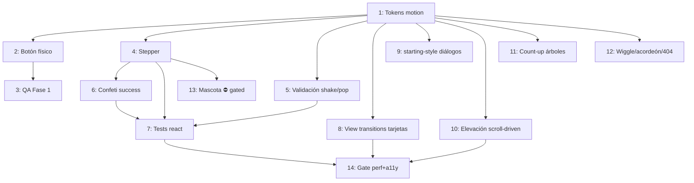

# Implementation Workflow: Animaciones estilo Duolingo

- **Fuente**: propuesta acordada en sesión (2026-08-22) — micro-interacciones con física de resorte, celebración y personalidad, **sin runtimes de animación** (ni Rive ni Lottie ni GSAP).
- **Estrategia**: incremental — cada fase es desplegable por sí sola vía `develop` → QA → `main`.
- **Estado**: planificado, sin ejecutar. Para retomar: ejecutar la siguiente tarea con `[ ]` respetando `Depende de`; marcarla `[x]` al quedar implementada y verificada en el working tree (el merge a `develop` se hace al cerrar cada fase, cuando el usuario lo pida).
- **Cómo retomar con Claude**: `Ejecuta la siguiente tarea pendiente de docs/06-plan-animaciones.md con el modelo asignado` (o `/loop` con ese mismo prompt para avanzar tarea por tarea de forma autónoma).

## Resumen de requisitos

- **Funcional**: vocabulario de motion compartido; micro-interacciones en botones, formularios, tarjetas y navegación; celebración en la conversión (inscripción); animaciones scroll-driven en piezas editoriales SVG.
- **No funcional (innegociable)**: Lighthouse 95+, LCP < 2.0s, INP < 200ms, CLS < 0.05. Solo `transform`/`opacity`. Todo bajo `@supports` + `prefers-reduced-motion: no-preference` con estado final visible sin soporte (patrón ya establecido en `src/styles/global.css`). Cero JS nuevo fuera de los 6 islands existentes. WCAG 2.1 AA.
- **Fuera de alcance**: runtimes Rive/Lottie/GSAP/Motion; animar el hero (LCP) o texto de lectura; loops infinitos llamativos; nuevas islands.

## Convenciones de ejecución

- **Modelo por tarea**: `Sonnet` para trabajo bien especificado y mecánico; `Opus` para tareas con decisiones de diseño, riesgo de regresión o integración delicada (islands, ClientRouter, SVG del sistema editorial).
- **Agente sugerido**: agentes del proyecto en `.claude/agents/` (`astro-dev`, `performance-engineer`, `qa-auditor`, `accessibility-tester`).
- **Antes de tocar secciones**: leer `docs/04-sistema-editorial.md`. Duraciones: 150–300ms micro, 400–600ms celebraciones.
- **Gotcha conocido**: con `animation-timeline`, usar longhands — Lightning CSS rompe la regla si `view()`/`scroll()` va dentro del shorthand `animation` (documentado en `global.css`).
- **Tokens nuevos siempre con nombre propio** (`--ease-spring`, no `--ease-out`): no pisar la escala por defecto de Tailwind 4 (misma lección que `--radius-chip` / `--shadow-card`).

## Fase 1 — Fundación (½ día)

| # | Tarea | Modelo | Agente | Archivos | Depende de | Complejidad | Riesgo |
|---|-------|--------|--------|----------|------------|-------------|--------|
| 1 | `[x]` Tokens de motion en `@theme`: `--ease-spring`, `--ease-pop` (con `linear()`), duraciones `--duration-micro/celebration` | Sonnet | astro-dev | `src/styles/global.css` | — | Baja | Bajo |
| 2 | `[x]` Botón "físico": sombra dura inferior (token propio, p. ej. `--shadow-pressable`) que se comprime en `:active` con `translateY(2px)`; variantes primaria/acento | Sonnet | astro-dev | `src/components/common/Button.astro`, `global.css` | 1 | Media | Bajo |
| 3 | `[x]` Verificación: reduced-motion, focus visible intacto, sin CLS en estados hover/active; `npm run test:run` + revisión visual | Sonnet | qa-auditor | — | 2 | Baja | Bajo |

## Fase 2 — Conversión (1 día; la de mayor valor de negocio)

| # | Tarea | Modelo | Agente | Archivos | Depende de | Complejidad | Riesgo |
|---|-------|--------|--------|----------|------------|-------------|--------|
| 4 | `[x]` Stepper de inscripción: barra de progreso que llena con `--ease-pop`, checkmark SVG que se dibuja (`stroke-dashoffset`) y squash & stretch del número al completar paso | **Opus** | astro-dev | `src/components/interactive/InscriptionForm.tsx` | 1 | Alta | Medio — island de 4 pasos con localStorage 48h TTL; no romper persistencia ni navegación entre pasos |
| 5 | `[x]` Validación con feedback: shake horizontal en error (3 oscilaciones, ~300ms), pop del checkmark en campo válido; estados ya expuestos por react-hook-form | Sonnet | astro-dev | `InscriptionForm.tsx`, `ContactForm.tsx`, `global.css` | 1 | Media | Bajo |
| 6 | `[x]` Confeti en success: decidir entre CSS puro (~30 partículas DOM) vs `canvas-confetti` (~5KB) con `import()` dinámico solo al llegar a success; costo cero en carga inicial es criterio de aceptación | **Opus** | astro-dev + performance-engineer | `InscriptionForm.tsx`, `ContactForm.tsx` | 4 | Media | Medio — bundle del island; medir antes/después |
| 7 | `[x]` Tests react de los estados animados (Testing Library + vitest-axe); mantener coverage `interactive` ≥ 80% | Sonnet | astro-dev | `src/components/interactive/__tests__/` | 4, 5, 6 | Media | Bajo |

## Fase 3 — Navegación viva (½–1 día)

| # | Tarea | Modelo | Agente | Archivos | Depende de | Complejidad | Riesgo |
|---|-------|--------|--------|----------|------------|-------------|--------|
| 8 | `[x]` `transition:name` en tarjeta → detalle: noticias, árboles, especies (morph de imagen vía ClientRouter ya montado). Riders descartado (sin página real) y titulares descartados (ver nota) | **Opus** | astro-dev | `NewsCard`, `TreeCard`, `BaseLayout`, páginas de detalle | 1 | Alta | Alto — interacción con ClientRouter, ScrollDepth y Partytown; nombres deben ser únicos por página |
| 9 | `[x]` Entradas con `@starting-style` + `transition-behavior: allow-discrete` en diálogo de SiteSearch, MobileMenu y Lightbox | Sonnet | astro-dev | `SiteSearch.tsx`, `MobileMenu.tsx`, `ImageLightbox.tsx`, `global.css` | 1 | Media | Bajo — mantener focus trap intacto |

## Fase 4 — Deleite editorial (1 día)

| # | Tarea | Modelo | Agente | Archivos | Depende de | Complejidad | Riesgo |
|---|-------|--------|--------|----------|------------|-------------|--------|
| 10 | `[x]` Perfil de elevación que se dibuja al scroll (barrido por `clipPath` + `animation-timeline`; ver nota), ciclista descartado | **Opus** | astro-dev | `ProgramPathway.astro`, `src/pages/404.astro`, `global.css` | 1 | Alta | Medio — SVG build-time del sistema editorial; longhands obligatorios |
| 11 | `[x]` Count-up CSS del total de árboles (`@property` + integer animado + `counter()`); fallback = cifra estática | Sonnet | astro-dev | `TrochaVerde.astro` / `StatsCounter.astro`, `global.css` | 1 | Media | Bajo |
| 12 | `[x]` Remate: wiggle de iconos Phosphor en hover de tarjetas, acordeón FAQ con `interpolate-size: allow-keywords`, bamboleo idle del ciclista del 404 | Sonnet | astro-dev | `NewsCard`, `RiderCard`, `EventCard`, `FaqAccordion.astro`, `404.astro` | 1 | Baja | Bajo |

## Fase 5 — Mascota (opcional, ⛔ gated: requiere decisión de marca del club)

| # | Tarea | Modelo | Agente | Archivos | Depende de | Complejidad | Riesgo |
|---|-------|--------|--------|----------|------------|-------------|--------|
| 13 | `[ ]` Exploración de mascota SVG+CSS (saludo en success de inscripción, idle en 404); Rive solo si se aprueba personaje interactivo, y nunca en portada | **Opus** | astro-dev + cmo-marketing-director | por definir | 4, decisión de marca | Alta | Medio |

## Gate final (tras cada fase, obligatorio antes de `main`)

| # | Tarea | Modelo | Agente | Depende de |
|---|-------|--------|--------|------------|
| 14 | `[ ]` Auditoría: Lighthouse ≥ 95, CLS < 0.05, INP < 200ms; barrido con `prefers-reduced-motion: reduce` activo (nada debe quedar oculto o en movimiento); keyboard nav y focus | **Opus** (revisión) | qa-auditor + accessibility-tester | fase correspondiente |

### Notas acumuladas para el gate 14 (de las auditorías por fase)

- **Preexistente, no introducido por el plan**: el anillo de foco `focus-visible:outline-primary` de `Button.astro` da ~2.42:1 contra fondos claros — por debajo del 3:1 de WCAG 1.4.11. Migrar a `-deep` o token propio de foco (QA Fase 1).
- Considerar texto `sr-only` de "completado" en los indicadores del stepper de `InscriptionForm` (sugerencia del implementador de la Tarea 4; cambia el contenido leído, por eso se difirió al gate).
- Decisión registrada: el hover de `Button` ya no hace fade de color (en Tailwind 4 dos utilities `transition-*` no se combinan; se priorizó transicionar solo `transform`). Confirmado intencional en QA Fase 1.
- CSS muerto preexistente: `--shadow-card/raised/overlay` sin usos en `src/` (QA Fase 1).
- **Reduced motion en view transitions: ya resuelto por Astro** (Tarea 8). `astro/components/viewtransitions.css` —que el compilador inyecta en cuanto un componente usa una directiva `transition:*`— trae `@media (prefers-reduced-motion) { ::view-transition-group(*), ::view-transition-old(*), ::view-transition-new(*), [data-astro-transition-scope] { animation: none !important } }`. Va sin capa, así que su `!important` gana a las reglas de Astro (`@layer astro`) y a las del UA. Verificado presente en el `dist/` construido. **No se añadió CSS propio**; para el gate basta comprobar con la preferencia activa que la navegación es un salto instantáneo, sin morphs.
- **Decisión registrada (Tarea 8): solo morfean las imágenes, no los titulares.** Tres motivos: (1) en las tres tarjetas el titular envuelve el enlace estirado (`after:absolute after:inset-0`) que hace clicable la tarjeta entera — ponerle un `view-transition-name` a un ancestro de ese enlace arriesga re-anclar el overlay y encoger el área de clic, un fallo funcional, no cosmético; (2) en árbol y especie el `<h1>` del detalle lo pinta `SectionIntro`, primitiva compartida por 16 páginas (mismo criterio de alcance que la Tarea 11 con `StatFigure`); (3) en especie el texto ni siquiera es equivalente (la tarjeta dice "Mango", el `<h1>` una frase generada). Si el gate lo pide, el par de noticias es el único candidato viable sin tocar primitivas compartidas.
- **Hallazgo preexistente (Tarea 8), no corregido**: `<Header transition:persist />` de `BaseLayout` **no persiste nada**. El compilador lo convierte en la prop `data-astro-transition-persist` y `Header.astro` no recibe ni propaga props, así que el atributo nunca llega al HTML (verificado en `dist/`: cero ocurrencias en las 146 páginas). La cabecera se reconstruye en cada navegación; el comentario de `SiteSearch.tsx` ("la cabecera es `transition:persist`") parte de una premisa falsa. Corregirlo cambia el ciclo de vida de los islands de la cabecera, así que se deja como decisión aparte.
- **Interacción `.reveal` ↔ morph (Tarea 8)**: al volver *del detalle al listado*, la tarjeta de destino vive dentro de un `<li class="reveal">` que todavía está en `opacity: 0` cuando el navegador captura el estado entrante (`.revealed` lo pone un IntersectionObserver, siempre posterior). El morph aterriza sobre un destino transparente y la tarjeta aparece después con su propia transición de reveal. La dirección tarjeta → detalle (la que pide la tarea) no se ve afectada: ninguna imagen destacada está dentro de un `.reveal`. Para el gate: decidir si se compensa con una regla `:active-view-transition` en `global.css`.
- **Decisión registrada (Tarea 10): el trazo se descubre con un barrido por `clipPath`, no con `stroke-dashoffset`.** Medido en Chrome sobre el path real: con `vector-effect="non-scaling-stroke"` (que llevan todos los trazos del perfil) el patrón de guiones se mide en el espacio de pantalla mientras `pathLength` normaliza sobre la geometría sin transformar, y con el SVG estirado (`preserveAspectRatio="none"`) las dos longitudes divergen — a 1160×176 el estado "dibujado" (`stroke-dashoffset: 0`) pierde el último 12% del trazo. El barrido (`<rect>` de un `<clipPath>` que va de `scaleX(0)` a `scaleX(1)`) no depende de longitudes, solo anima `transform` y deja el marcado completo cuando no hay animación. Detalle en `docs/04-sistema-editorial.md` §2.5. **Corrección (gate 14):** esto vale solo para el perfil de elevación. `stroke-dashoffset` sí se usa en el plan — el checkmark del stepper lo anima en `@keyframes if-check-draw` (`src/styles/global.css`, Tarea 4). Es un SVG de 24×24 en una interacción puntual, impacto nulo, pero conviene no leer esta nota como que la regla "solo `transform`/`opacity`" se cumplió al 100%.
- **Decisión registrada (Tarea 10): el ciclista no viaja por la traza, en ninguna de las dos superficies.** En el 404 está fuera de ruta a propósito (es la metáfora de la página) y ya tiene su bamboleo de la Tarea 12; en `ProgramPathway` sencillamente no existe un ciclista, y `offset-path: path()` no sirve para inventarlo: sus coordenadas son px fijos y el perfil se estira de forma no uniforme, así que la traza en px no se puede conocer en build. La única vía viable a futuro sería `offset-path: shape()` con coordenadas en porcentaje (`elevationPointAt` ya las da), pero eso agrega un elemento decorativo nuevo a la sección de referencia y depende de soporte más nuevo que `animation-timeline`. Para el gate: el 404 solo dibuja el sendero.
- **Tarea 10 tocó cinco `SectionShell` para ponerles `scrollDriven`** (`ProgramsGrid`, `/programas`, `/programas/[slug]`, `/inscripciones`, `404`): sin eso el `overflow-hidden` del marco ancla la línea de tiempo a la sección y el trazo se queda congelado a medias (verificado en Chrome: el valor congelado depende de la geometría, no siempre es "completo"). Efecto lateral esperado: en las cuatro que llevan `pattern="topo"`, la textura de fondo gana la deriva `sda-parallax-slow` que ya usa `/quienes-somos`. Para el gate: revisar que esa deriva no moleste en esas cuatro páginas.
- **Resuelto en el gate 14 — el morph de las tarjetas ya no usa la directiva `transition:name`, sino la propiedad CSS en línea.** Responde a la advertencia de la auditoría de rendimiento (más abajo): Astro emite ~2,4 KB de `<style>` en el `<head>` **por elemento nombrado y sin deduplicar**, y ese CSS bloquea render y no se cachea (`.htaccess` sirve HTML con `max-age=0`, a diferencia de `_astro/*.css`, que es `immutable`). En los tres listados las tarjetas declaran ahora `style="view-transition-name: …"` (~46 B) en lugar de la directiva; **las tres páginas de detalle la conservan**.

  Por qué el comportamiento no cambia, verificado leyendo `astro@7.1.6`, no deducido: (1) el emparejamiento de una view transition es **por nombre**; la directiva no aporta nada más que un `<style>` con `[data-astro-transition-scope="…"] { view-transition-name: … }`, y `data-astro-transition-scope` es solo un gancho CSS — ninguna línea de JS del router lo lee (`grep` en `node_modules/astro/dist/`: solo aparece en las cadenas CSS que emite `renderTransition`, en `viewtransitions.css` y en la lista de atributos que `hydration.js` preserva). (2) `ClientRouter` reemplaza el `<head>` **dentro** del callback de `startViewTransition` (`updateDOM` → `doSwap` → `swapHeadElements`, que borra todos los `<style>` en línea del documento saliente), así que las reglas `::view-transition-old/new(nombre)` que gobiernan la animación son **siempre las de la página de destino**. Como el detalle mantiene su directiva, la ida tarjeta → detalle conserva exacto el fundido de Astro (`astroFadeOut`/`astroFadeIn`, 180 ms, `cubic-bezier(0.76, 0, 0.24, 1)`, `mix-blend-mode: plus-lighter`); el morph de posición/tamaño es del navegador en los dos casos, porque `fade()` nunca emite regla de `::view-transition-group`.

  Por eso el detalle **no** se unifica: es una sola instancia por página (2,4 KB que no escalan) y es justo el lado cuyas reglas se usan. Único cambio de matiz, en la vuelta detalle → listado: el fundido cruzado pasa a ser el del navegador, porque al llegar al listado su `<head>` ya no trae esas reglas. Es inobservable hoy — la nota de la Tarea 8 sobre `.reveal` ya dejaba claro que en esa dirección el morph aterriza sobre una tarjeta en `opacity: 0`.

  Cifras medidas en `dist/` (146 páginas, `npm run build:only` antes y después):

  | Página | CSS de VT en `<head>` | `<head>` crudo | HTML crudo | HTML gz |
  |---|---|---|---|---|
  | `/trocha-verde` | 72 024 → **2 337 B** (−96,8 %) | 79 586 → 9 899 B (−87,6 %) | 321 215 → 251 611 B (−21,7 %) | 39 596 → **37 204 B** (−2 392 B, −6,0 %) |
  | `/noticias` | 24 679 → **2 337 B** (−90,5 %) | 31 178 → 8 836 B (−71,7 %) | 110 020 → 87 883 B (−20,1 %) | 21 701 → **20 787 B** (−914 B, −4,2 %) |
  | `/` (portada) | 9 793 → **2 337 B** (−76,1 %) | 19 767 → 12 326 B (−37,6 %) | 151 685 → 144 321 B (−4,9 %) | 33 702 → **33 300 B** (−402 B, −1,2 %) |
  | `/noticias/{id}` (detalle) | 4 809 B (igual) | 14 477 B (igual) | +9 B | +21 B |
  | `/trocha-verde/arboles/{id}` | 4 719 B (igual) | 12 102 B (igual) | +9 B | +26 B |

  Los +9 B de las páginas de detalle son el comentario de `BaseLayout` reescrito (los comentarios `<!-- -->` sí viajan al HTML), no las transiciones. En todo el sitio: 616 → 263 bloques `<style>` de view transitions, 1 482 797 → 624 864 B (−858 KB), a cambio de 20 265 B de atributos `style` — **HTML total del `dist/`: 12 629 256 → 11 776 632 B (−852 624 B, −6,8 %)**. El bundle `_astro/*.css` no se toca.

  Verificado además en el `dist/` construido: los **352** pares listado → detalle resuelven al mismo string en las dos páginas, **cero** nombres repetidos dentro de una misma página (un duplicado cancelaría toda la transición), `page-main` presente en las 144 páginas que usan `BaseLayout` y la regla `@media (prefers-reduced-motion) { ::view-transition-group(*)… }` de `viewtransitions.css` también en las 144 — la inyecta la directiva que `BaseLayout` mantiene en `<main>`, así que quitar directivas de las tarjetas no puede dejar sin cubrir a nadie. Las dos páginas sin la regla son `/admin` (archivo copiado de `public/`) y `/enlaces` (usa `LinktreeLayout`); ninguna tiene view transitions, es preexistente.

  Sobre el contador de la Tarea 8: quitar directivas lo mueve, pero ya no importa. En todo el sitio solo quedan **dos** nombres autogenerados y ninguno empareja entre páginas: `astro-dj2qnjhp-1`, el `<h1 transition:animate="slide">` de `PageLayout`, que usa una sola ruta viva (`/politica-de-tratamiento-de-datos`), y —antes de este cambio— `astro-nm6ldhmm-1`, una tarjeta de especie sin ficha de destino. Esa segunda **desaparece**, y es una mejora: su nombre autogenerado la sacaba del fundido de página en vez de dejarla fundirse con el resto, que es lo que su propio comentario decía que hacía. Todo lo que sí empareja (`page-main` y los tres pares de imagen) lleva nombre escrito, inmune al orden de render.

  Efecto lateral que también corrige: la directiva estaba atada a la prop **opcional** `transitionName` de `NewsCard`, así que se aplicaba incluso en las tarjetas que no reciben nombre (las crónicas relacionadas), gastando 2,4 KB en un nombre que no encadenaba con nada. Sin `transitionName` ahora no se emite ni el atributo `style`.

  Los ids siguen siendo identificadores CSS válidos sin pasar por el `cssesc` de Astro: los genera el glob loader ya slugificados (minúsculas, sin acentos), no hay ningún `slug:` en el frontmatter que se salte esa slugificación, y los prefijos `news-img-`/`tree-img-`/`species-img-` evitan que empiecen por dígito (que es lo único que rompería con ids como `2026-05-copa-valle-xco-cali`). Los mismos ids ya se interpolan crudos en los `href`.

- Decisión registrada (Tarea 6): confeti **CSS puro**, no `canvas-confetti`. Motivos: cero dependencias, la CSP de producción (`default-src 'self'`, sin `blob:` ni `worker-src`) haría fallar el worker que canvas-confetti crea desde un Blob, y 28 `` animando solo `transform`/`opacity` bastan para la celebración. Vive en un chunk aparte (`SuccessConfetti.tsx` → `import('./ConfettiBurst')`) que solo se descarga al llegar a la pantalla de éxito y solo sin `prefers-reduced-motion: reduce`. Para el gate: verificar con la preferencia activa que la vista de éxito de `/inscripcion` y `/contacto` se ve idéntica a la de antes (ni partículas ni chunk descargado).

### Gate 14 — Auditoría de accesibilidad (accessibility-tester, 2026-08-22)

Alcance: las 12 tareas de las Fases 1–4 en el working tree. Método: revisión estática del
`git diff` + verificación del CSS **construido** (`npm run build:only`, 146 páginas) para
comprobar que Lightning CSS no saca ninguna regla de su guarda, + `axe-core` 4.11.1 sobre
9 páginas del `dist/` bajo jsdom, + `npm run test:run` (61 archivos / 1386 tests, todos en
verde). **Veredicto: sin bloqueantes; el plan es apto para `main` en lo que toca a
accesibilidad.**

**1. `prefers-reduced-motion: reduce` — barrido exhaustivo: PASA, 12/12.** Verificado en el
CSS de salida, no solo en el fuente:

- `if-check-draw` / `if-step-pop` / `field-shake` / `field-pop` / `confetti-fall` /
  `confetti-flip` quedan dentro de un único `@media (prefers-reduced-motion:no-preference)`
  tras el merge de Lightning CSS. Crítico y correcto: `stroke-dasharray: 24` de
  `.if-step-check` y la caja+color de `.confetti-piece` viven **dentro** de la guarda, así
  que bajo `reduce` el check se pinta entero y una partícula no tiene ni tamaño ni fondo.
- `.sda-trail-sweep` (404 y `ProgramPathway`): sin la guarda no se declara ni animación ni
  `transform-origin`, y el `<rect>` del `clipPath` mide `0 0 1000 260` = el `viewBox`
  completo → perfil entero. Además, si la `view-timeline` quedara inactiva el efecto no
  produce valor y se cae al estilo base, que es el mismo estado completo.
- Count-up (`TrochaVerde.astro:197-227`): tres capas de respaldo y el estado de reposo es
  siempre `--tv-count: var(--count-target)`. Bajo `reduce` no se llega a declarar el `0`.
- FAQ (`FaqAccordion.astro:67-95`): `::details-content` sobrevive a Lightning CSS
  (verificado en `dist/preguntas-frecuentes/index.html`); bajo `reduce` solo se anula la
  `transition`, `height: 0` ↔ `[open] height: auto` sigue siendo el comportamiento nativo.
- Ciclista del 404: la `animation` está dentro de `no-preference`; los `@keyframes` quedan
  fuera (correcto) y animan `rotate`, no `transform`, así que no pisan el
  `-translate-x/y-1/2` que lo posiciona. Bajo `reduce` queda quieto y en su sitio.
- Los ocho `motion-reduce:*` nuevos (Button, los tres overlays, riel del stepper, iconos de
  `NewsCard`/`EventCard`) **ganan la cascada**: en el bundle, el bloque
  `@media (prefers-reduced-motion:reduce)` de Tailwind sale en el offset ~100 728, después
  de `group-hover:rotate-[8deg]` (~88 451), `hover:-translate-y-px` (~89 992) y
  `active:translate-y-1` (~99 602), con la misma especificidad → empate resuelto por orden.
- `@starting-style` + `motion-reduce:transition-none`: con `transition-property: none` no
  arranca transición, así que el estilo de arranque nunca llega a pintarse. No hay
  destello ni estado intermedio.

**2. Teclado y focus traps: PASA.** Ninguna de las tres islas de overlay cambió su lógica
—solo clases de transición—: Escape, ciclado de Tab, `focusable[0].focus()` al abrir y
devolución al disparador siguen intactos en `MobileMenu.tsx:26-76`,
`ImageLightbox.tsx:26-79` y `SiteSearch.tsx:278-310`. En `InscriptionForm`, el
`setFocus()` posterior al `triggerShake()` **no se rompe**: React reconcilia el mismo nodo
y solo reescribe `class`, nunca lo desmonta, así que el foco sobrevive al ciclo
remove → `requestAnimationFrame` → add.

**3. Lectores de pantalla: PASA con dos deudas preexistentes** (ver abajo). El count-up
nunca expone el conteo (dígito `aria-hidden`, cifra real en `sr-only`); el confeti es
`aria-hidden` + `pointer-events-none` y en `ContactForm` está fuera del `role="status"`,
así que no duplica el anuncio; `aria-invalid`/`aria-describedby` de `ContactForm` no los
tocó el shake (la clase la gobierna un `Set` aparte de `errors`); `ValidCheckmark` es
`aria-hidden` y no añade ruido.

**4. WCAG 2.2.2 (Pause/Stop/Hide) — bamboleo del 404: NO bloqueante, se acepta.** Es el
único loop infinito del plan y **sustituye** a un `motion-safe:animate-pulse` que ya era
infinito, así que no hay regresión. Formalmente cae en el criterio (arranca solo, dura
más de 5 s, convive con otro contenido), pero: es decorativo (`aria-hidden`), mide 44 px,
son ±2° sin cambio de luminancia (2.3.1 no aplica), vive en una página sin lectura extensa
y para en seco con `prefers-reduced-motion` —que el Understanding de 2.2.2 admite como
mecanismo del agente de usuario—. Si se quiere cerrar el criterio sin discusión:
`animation-iteration-count: 3` en `404.astro:277-280`.

**5. Contraste: sin regresiones.** Recalculadas las cuatro variantes de `Button` tras la
Tarea 2 — primary 5.53:1, accent 8.14:1, secondary 9.39:1, outline 5.88:1, y los tres
estados hover ≥ 5.18:1. El `ValidCheckmark` (`text-green-600` ≈ `#00a63e`) da 3.22:1 sobre
blanco, por encima del 3:1 de 1.4.11 aunque sea decorativo. Los colores del confeti son
decorativos y transitorios.

**Hallazgos nuevos, introducidos por el plan** (ninguno bloqueante):

- **[Advertencia] La rejilla de cifras de `TrochaVerde.astro:82` ganó `.reveal`.** Antes
  era contenido siempre visible; ahora, con JS deshabilitado o fallido **y** sin
  `prefers-reduced-motion`, se queda en `opacity: 0` para siempre (la clase la enciende el
  IntersectionObserver de `BaseLayout.astro:150-166`). El `<noscript>` de las líneas
  119-124 solo repara `--tv-count`, no la opacidad. Bajo `reduce` no ocurre: la regla de
  `global.css:913` va sin capa y gana a `@layer utilities`. Arreglo mínimo: añadir
  `.reveal { opacity: 1; transform: none }` al mismo `<noscript>`, o mover el count-up a
  un disparador que no sea `.reveal`.
- **[Nota] El borde duro de `--shadow-pressable` no es zona clicable.** Los 4 px de
  `Button.astro:43` se pintan fuera del border-box: un toque en el "canto 3D" no activa
  nada. El botón `md` mide 44 px reales y aparenta 48. Sin impacto en WCAG 2.1 AA (2.5.5
  es AAA), pero sí contra la regla de 48×48 del proyecto. Si se quiere cerrar:
  `pb-[calc(...)]`+`-mb-1`, o aceptar el desfase.
- **[Nota] El confeti cae sobre el texto de la tarjeta de éxito.** En `/inscripciones` esa
  tarjeta contiene la lista de documentos a preparar; 28 partículas opacas la cruzan
  durante ~2,4 s. No incumple ningún criterio (es finito, decorativo y se apaga con
  `reduce`), pero para accesibilidad cognitiva convendría acotar la lluvia al tercio
  superior de la tarjeta.
- **[Nota] Los iconos con wiggle solo reaccionan a `group-hover`, no a `group-focus`.** Es
  correcto (son decorativos), pero deja el sitio con dos criterios distintos en la misma
  tarjeta: el icono nuevo respeta `motion-reduce` y el `group-hover:scale-105` de la foto
  de al lado (preexistente) no.
- **[Nota] Comentario inexacto.** `InscriptionForm.tsx:967` dice que "el mensaje de
  error/`aria-invalid` ya comunican el estado real", pero ese componente **no usa
  `aria-invalid` en ningún campo** (sí `ContactForm`). El razonamiento sigue siendo válido
  por los `role="alert"`, pero el comentario induce a error.

**Deudas preexistentes confirmadas** (no introducidas por estas 12 tareas, pero tocan
piezas que el plan modificó):

- **[Mayor] `InscriptionForm` no anuncia el envío exitoso.** La pantalla de éxito
  (`InscriptionForm.tsx:327-389`) no tiene `role="status"` ni mueve el foco, y sustituye al
  `<form>` que contenía el único `aria-live` (línea 400). El foco cae a `<body>` y el
  lector no dice nada: silencio en la conversión principal. `ContactForm` sí trae
  `role="status"`, pero se inserta ya poblado en el mismo commit de React, lo que
  VoiceOver no anuncia de forma fiable. Arreglo para ambos: un `
` montado desde el inicio, fuera del condicional, y
  mover el foco al `<h2>`/`<h3>` de éxito con `tabIndex={-1}`.
- **[Mayor] El cajón de `MobileMenu` vive siempre en el DOM.** Tras hidratar,
  `MobileMenu.tsx:114-121` deja un `role="dialog" aria-modal="true"` permanente en `<body>`
  (vía portal, así que el `lg:hidden` de `Header.astro:183` no lo alcanza) desplazado con
  `translate-x-full`, sin `inert` ni `hidden`. Sus ~10 enlaces y el botón de cierre siguen
  en el orden de tabulación y en el árbol de accesibilidad **en cualquier viewport**, y el
  `aria-modal` permanente puede llevar a algún lector a tratar el resto de la página como
  inerte. Arreglo: `inert={!isOpen}` (o montaje condicional del cajón, como ya se hace con
  el overlay).
- **[Mayor] El lightbox no anuncia el cambio de foto.** Con las flechas cambian el ``
  y el contador `n / total` (`ImageLightbox.tsx:183-190`) sin `aria-live`; el foco se queda
  en un botón cuyo `aria-label` no cambia. Arreglo: `aria-live="polite"` en el bloque del
  contador.
- **[Advertencia] No hay red de seguridad global de `reduce`.** `global.css` solo tiene dos
  bloques `prefers-reduced-motion: reduce` (líneas 913 y 1051) y ningún catch-all, así que
  ~24 `transition-transform` preexistentes (los `group-hover:scale-105` de
  `NewsCard`/`TreeCard`/`RiderCard`/`AlbumCard`/`ProgramsGrid`, el caret del FAQ, etc.)
  siguen animando con la preferencia activa. Recomendado: un bloque
  `*, *::before, *::after { animation-duration: .01ms !important; animation-iteration-count: 1 !important; transition-duration: .01ms !important }`
  bajo `reduce`; comprobado que no rompe `.reveal` (ya forzado a `opacity: 1`) ni
  `SponsorsBar` (ya usa `animation: none`).
- **[Advertencia] Anillo de foco (confirmando la nota de QA Fase 1).** `outline-primary`
  (`#20b7c9`) da **2.42:1** sobre blanco (cálculo propio, coincide). Recomendación
  concreta: token nuevo `--color-focus-ring: var(--color-primary-deep)` en `@theme` y
  `focus-visible:outline-[--color-focus-ring]` en `Button.astro:52` → **5.88:1** sobre
  blanco y 5.6:1 sobre `surface-tint`. Ojo con el único contexto oscuro: los dos botones
  del `Hero` sobre foto; ahí `#0f6f79` bajaría a ~2.3:1, así que el botón `outline` del
  hero necesita su propio `focus-visible:outline-white` (21:1), en la misma línea donde ya
  sobrescribe `border-white text-white` (`Hero.astro:140-147`).
- **[Advertencia] Stepper: los pasos completados no tienen texto.** Resolviendo el punto
  diferido de la Tarea 4: el indicador completado (`InscriptionForm.tsx:427-433`) solo
  contiene un `<svg aria-hidden>`, y su `shortLabel` es `hidden sm:block`
  (`display: none` en móvil) → en móvil el `<li>` se anuncia **vacío**. Recomendación:
  `Paso {idx + 1} completado` junto al SVG, y dejar los
  pasos pendientes como están (el `aria-live` de la línea 400 ya da el contexto del paso
  actual, así que añadir más texto solo aportaría verbosidad).

**Axe automatizado.** Sin navegador headless en el entorno (no hay
puppeteer/playwright/lighthouse instalados), así que se corrió `axe-core` 4.11.1 sobre el
HTML construido dentro de jsdom, con `color-contrast` desactivado (jsdom no hace layout ni
paint). Páginas: `/`, `/inscripciones`, `/contacto`, `/noticias`, `/trocha-verde`, `/404`,
una crónica, una ficha de árbol y una galería. **Cero violaciones atribuibles a las 12
tareas.** Lo que sale es preexistente: `region` (cinta de anuncio, FAB de WhatsApp y
`conversion-bar` fuera de landmarks), `landmark-complementary-is-top-level` (los `<aside>`
dentro de `<article>` en crónica y ficha de árbol) y un `aria-prohibited-attr` incompleto
en el badge `` de `/trocha-verde`. Las dos violaciones
`label` (`input[name="botcheck"]`) son **falsos positivos de jsdom**: son los honeypots de
Web3Forms con `class="hidden"`, que en un navegador real axe descarta por `display: none`.
Queda pendiente para quien tenga navegador: contraste real con DevTools y una pasada de
Lighthouse de accesibilidad.

**Recomendación de prueba que falta:** ni `InscriptionForm.react.test.tsx` ni
`ContactForm.react.test.tsx` afirman nada sobre el foco (`toHaveFocus` no aparece en
ninguno). Vale la pena un test de regresión que compruebe `document.activeElement` después
de un `handleNext` fallido, justo cuando `field-shake` está aplicado — es el punto exacto
donde el re-disparo por `requestAnimationFrame` podría chocar con `setFocus()` en el
futuro.

---

#### Auditoría de RENDIMIENTO del gate 14 (qa-auditor, 2026-08-22)

**Cómo se midió.** `npx lighthouse` 13.4.1 sí funciona en este entorno (se descarga al
vuelo) contra Chrome estable local; corrige la nota de arriba que lo daba por ausente.
Método: `npm run build:only` servido con `npm run preview` (sirv sí manda gzip) y, en
paralelo, el **mismo repo en `HEAD` construido en un worktree aparte** para tener línea
base sin tocar el working tree. Preset móvil por defecto, 3 corridas por página, se
reporta la mediana. Lo que Lighthouse NO cubre —no hace scroll— se midió con Chrome
headless por CDP: CLS recorriendo la página entera, INP por Event Timing y long tasks
durante el scroll.

- **Bloqueante del gate tal como está redactado, NO regresión: el presupuesto Lighthouse
  no se cumple ni antes ni después.** Medianas de 3 corridas (móvil, preview local):
  `/` 80 (HEAD 67), `/inscripciones` 81 (HEAD 81), `/programas` 77 (HEAD 77). LCP: `/`
  5.15 s (HEAD 6.04 s), `/inscripciones` 4.98 s (HEAD 4.99 s), `/programas` 5.958 s
  (HEAD 5.947 s). Todo lejos del ≥95 y del LCP < 2.0 s, y todas las diferencias caben en
  el ruido de corrida a corrida (la portada osciló 55–80 en el build actual). La causa
  está fuera de estas 12 tareas: **657 KB de fuentes** (`InterVariable.woff2` 352 KB +
  `PlusJakartaSans-Variable.woff2` 305 KB, ambas sin subsetear y ambas con `<link
  rel=preload>`) compitiendo con el preload del hero, más 370 KB de imágenes.
  **Resuelto el 2026-08-26** por la tarea 2 de `docs/08-plan-creatividad-ui.md`: los
  subsets `-latin` bajan las fuentes de 657 KB a 160 KB (−76 %). De paso se descubrió
  que los 305 KB de `PlusJakartaSans-Variable.woff2` no eran una fuente sino la página
  404 de GitHub, así que ese peso era íntegramente basura y los títulos nunca se
  pintaron con Plus Jakarta Sans. Falta volver a medir Lighthouse. Transfer
  total de la portada: 1.16 MB contra un presupuesto de 500 KB; JS de la portada 77.5 KB
  contra 50 KB (56.9 KB son el runtime de React, preexistente). Decisión que hay que
  tomar en el gate: o se ataca el subsetting de fuentes en un backlog aparte, o se
  reescribe el criterio de la Tarea 14 con cifras alcanzables. Ojo: estas cifras son de
  `astro preview` en portátil, no de Hostinger — no sirven para certificar producción.
  (De paso, en la misma corrida: Accesibilidad 100, Best Practices 100, SEO 100.)
- **Advertencia — `transition:name` por tarjeta infla el HTML con CSS en línea no
  minificado. → CORREGIDO, ver la nota "Resuelto en el gate 14" más arriba.** Astro emite
  ~2.4 KB de `<style>` por elemento nombrado (el bloque
  completo `::view-transition-old/new` + variante `[data-astro-transition=back]` +
  fallback), sin deduplicar. `/trocha-verde` pasaba de 2.4 KB a **71.6 KB** de CSS de view
  transitions en `<head>` (+69 KB en crudo, +3.5 KB gz), `/noticias` +22 KB (+1.6 KB gz),
  `/` +7.4 KB (la portada entera pasaba de 137,266 a 151,685 B crudos: +2.3 KB gz). Es CSS
  que bloquea render y que **no se cachea**
  (el `.htaccess` sirve HTML con `max-age=0, must-revalidate`), a diferencia del bundle
  `_astro/*.css` que es `immutable`. No rompió ninguna métrica medida, pero el costo crecía
  lineal con el número de tarjetas: si la rejilla de árboles llegara a listar los ~77
  árboles en una sola página, eran ~185 KB de `<style>`. Se resolvió sin recortar el morph:
  las tarjetas declaran el nombre como propiedad CSS en línea (~46 B) y solo el detalle
  conserva la directiva, así que `/trocha-verde` queda en 2 337 B de CSS de view
  transitions y el techo deja de depender del número de tarjetas.
- **Advertencia — el acordeón FAQ anima `height` con una curva que sobrepasa.**
  `FaqAccordion.astro:75-78` usa `var(--ease-spring)` (una `linear()` con overshoot ~6%)
  sobre `height`: medido en Chrome, la altura final es 258 px pero el pico intermedio es
  267.2 px, así que todo lo que va debajo baja de más y vuelve a subir. La suma de las
  entradas `layout-shift` de una sola apertura es **~0.077**, 1.5× el presupuesto de CLS
  entero. **No cuenta**: con clic de confianza y con Enter sobre el `
` todas las
  entradas llegan con `hadRecentInput: true` y el CLS no excluido queda en 0 (verificado
  por CDP, no deducido). El riesgo queda latente: si alguna vez se abre un `
` sin
  input del usuario (script, `hidden=until-found`, auto-expansión por fragmento), esos
  0.077 sí computarían. Ya se comprobó que hoy no pasa: entrar por deep link
  (`/preguntas-frecuentes/#pregunta-experiencia-previa`) da CLS 0 y la misma altura de
  documento que en `HEAD`. Recomendación barata: usar una curva sin overshoot solo para
  esta transición, o quedarse con `--ease-spring` a sabiendas.
- **Nota — `stroke-dashoffset` sí se usó, al final.** La nota de la Tarea 10 dice que se
  descartó, y es cierto para el perfil de elevación; pero el checkmark del stepper lo anima
  en `src/styles/global.css:1085-1092` (`@keyframes if-check-draw`). Es SVG de 24×24 en una
  interacción puntual, impacto nulo — pero conviene corregir la nota para que nadie lea el
  plan y crea que la regla "solo `transform`/`opacity`" se cumplió al 100%. **Hecho:** la
  nota de la Tarea 10 lleva ya la corrección en línea.
- **Nota — peso, medido contra `HEAD` construido en paralelo.** CSS global
  (`_astro/ConsentBanner.*.css`): 131,848 B → 136,629 B en crudo, **20,606 → 21,535 B gz
  (+929 B, +4.5%)**. Ese delta es *neto*: incluye el ahorro de los `@source not '../../docs'`
  / `'../../.claude'` que se añadieron en la misma tanda, así que el CSS de animación por sí
  solo pesa algo más. JS, en gz: `InscriptionForm` 6,450 → 6,988 (+538); `ContactForm`
  2,523 → 2,934 (+411); `SiteSearch` 3,900 → 3,977 (+77); `MobileMenu` 1,754 → 1,793 (+39);
  `ImageLightbox` 1,732 → 1,789 (+57); chunk compartido de los formularios 27,089 → 27,434
  (+345). `client`/`react`/`react-dom`/`leaflet`/`ClientRouter`: byte por byte idénticos.
  **JS inicial por página: portada +116 B gz, `/contacto` +872 B gz, `/inscripciones`
  +999 B gz.**
- **Nota — el confeti cumple su criterio de aceptación.** `ConfettiBurst.JO_qvNIm.js` es
  chunk propio (1,221 B / 689 B gz), no está dentro de `ContactForm.*.js` ni de
  `InscriptionForm.*.js`, y **no aparece en ninguna de las 146 páginas HTML** (cero
  `modulepreload`, cero `<script src>`): solo se lo nombra el `__vite__mapDeps` del chunk
  de `SuccessConfetti`. Matiz para no confundirse leyendo `dist/`: el chunk de 92 KB que
  ahora se llama `SuccessConfetti.*.js` **no es el confeti** — es el chunk compartido de
  react-hook-form/zod/analytics que en `HEAD` se llamaba `analytics.*.js` (mismos dos
  importadores antes y después). Rollup solo lo rebautizó. Efecto lateral: al cambiar el
  nombre cambió el hash, así que el primer despliegue obliga a los visitantes recurrentes
  de `/contacto` e `/inscripciones` a rebajar 27.4 KB gz una sola vez.
- **Nota — el count-up no desplaza nada, y hay ~84 px de holgura.** Medido en Chrome sobre
  la portada: `--tv-count` recorre 0 → 77 en 1.2 s y el ancho del `` de dígitos pasa
  de 12.6 px a 26.2 px, pero el `
`, la columna, la posición de la etiqueta "Árboles
  sembrados" y la x de la segunda cifra se quedan clavados (110.5 px / x=68 / x=202.5) —
  quien manda el ancho de la columna es la etiqueta, no el número. Cero layout shift. La
  holgura son esos ~84 px: se rompería si `totalTrees` llegara a 4–5 dígitos **o** si
  alguien acorta la etiqueta. Y como el disparo es por scroll (`.revealed`), no por input,
  ese shift sí contaría en CLS el día que ocurra. Confirmado también que el `sr-only` lee
  siempre la cifra final, nunca el conteo.
- **Nota — CLS real, recorriendo la página entera (lo que Lighthouse no hace).** 0.000 en
  `/`, `/programas`, `/inscripciones` y `/404`, con el count-up, los `.reveal` y las
  scroll-driven corriendo. Lighthouse también dio 0 en las 12 corridas (ambos builds).
- **Nota — INP holgado.** Con 4× de estrangulamiento de CPU: submit inválido de
  `/contacto` (shake de todos los campos) 88 ms; `
` del acordeón 24 ms; abrir
  MobileMenu, abrir SiteSearch y navegar tarjeta → detalle con view transition quedaron
  **por debajo del umbral de 16 ms** con que Event Timing reporta, es decir, ni siquiera
  generaron entrada. La `startViewTransition` de ClientRouter no entra en el INP del clic
  porque la navegación es asíncrona: el frame siguiente al clic pinta antes.
- **Nota — la deriva `sda-parallax-slow` de la Tarea 10 no molesta al LCP.** Respuesta a la
  pregunta que dejó la Tarea 10: de las cinco `SectionShell` que ganaron `scrollDriven`,
  `/programas/[...slug]` no lleva `pattern="topo"`, así que solo hay cuatro con deriva
  nueva. La textura es `text-primary/14–16` a `-z-10` dentro de un `isolate`, con máscara
  que la apaga al 78%, y solo anima `transform`: no mueve texto, no puede generar CLS. El
  elemento LCP de la portada (`img.hero-poster`) vive en el hero, en otra sección — y esa
  ya tenía su propia deriva desde antes (`hero-topo sda-parallax-slow`), no es nueva. El
  único caso donde el LCP sí cae dentro de una sección recién derivada es `/programas`,
  cuyo LCP es el párrafo de entrada: LCP 5.958 s contra 5.947 s en `HEAD` (Δ +11 ms, ruido)
  y CLS 0 en las tres corridas. Además, **cero long tasks** durante el recorrido completo
  de `/`, `/programas`, `/inscripciones` y `/404` en los dos builds, con 6× de
  estrangulamiento — las scroll-driven no tocan el hilo principal.
- **Nota — suite y build limpios.** `npm run test:run`: 61 archivos, **1386 tests, todos en
  verde**. `npm run build:only`: sin un solo warning de CSS ni de Lightning CSS (los
  `@source not` cumplieron su promesa); los únicos `[WARN]` son los preexistentes de
  colecciones vacías (`rutas`, `pages`, `directivos`, `results`), ya documentados en
  `CLAUDE.md`. Sin CSS muerto: `animate-fade-in`, que `ImageLightbox` dejó de usar, ya no
  se genera en el bundle.
- **Nota — sobre el `.reveal` ↔ back-morph y el `transition:persist` no-op.** Ninguno de
  los dos tiene costo de rendimiento medible: el primero es puramente visual y el segundo
  solo hace que los dos islands de la cabecera (`MobileMenu`, `SiteSearch`) se
  rehidraten en cada navegación blanda — cosa que ya pasaba antes y que no llegó a
  producir una entrada de Event Timing en las navegaciones medidas. Se quedan como
  decisiones de producto/UX, no de perf.

## Grafo de dependencias

## Registro de riesgos

| Riesgo | Tareas | Mitigación |
|--------|--------|-----------|
| Regresión de bundle en islands (confeti) | 6 | `import()` dinámico post-success; comparar tamaño del chunk antes/después |
| `transition:name` duplicado o conflicto con Partytown/ScrollDepth | 8 | ✅ Resuelto: nombres `news-img-`/`tree-img-`/`species-img-` + slug (ids únicos por colección, verificado en el contenido real) y guarda de deduplicación en la rejilla de especies. Sin acoplamiento con Partytown/ScrollDepth: la directiva solo emite CSS y un atributo. Falta probar navegación con GA4 y consentimiento activos en preview |
| Nombrar tarjetas corre el contador de `transition:animate` y `main` deja de emparejar | 8 | ✅ Resuelto: `<main>` de `BaseLayout` lleva ahora `transition:name="page-main"` escrito. El nombre autogenerado (`astro-{hash}-{n}`) depende del orden de render de *todas* las directivas de la página y ya divergía en `/politica-de-tratamiento-de-datos` antes de esta tarea |
| Lightning CSS descarta reglas con `animation-timeline` en shorthand | 10 | Longhands siempre (patrón documentado en `global.css`) |
| Pisar escala por defecto de Tailwind 4 con tokens nuevos | 1 | Nombres propios (`--ease-spring`, `--shadow-pressable`) |
| Firefox estable sin scroll-driven animations (~84% global) | 10, 11 | Ya resuelto por diseño: `@supports` + estado final visible |
| Animaciones rotas para usuarios con reduced-motion | todas | Gate 14 audita con la preferencia activa antes de cada merge a `main` |

## Recomendaciones de ejecución

- **Paralelizable**: tras la tarea 1, las fases 2, 3 y 4 son independientes entre sí (9, 11 y 12 pueden correr en paralelo con 4–6).
- **MVP entregable**: al cerrar la Fase 2 (tareas 1–7) ya hay valor de negocio medible en el funnel de inscripción.
- **Mayor riesgo primero dentro de cada fase**: 8 y 10 merecen branch propio y QA en `develop` antes de mezclar con el resto.
- Flujo de ramas: feature branch → `develop` (QA con environment develop) → `main`.
