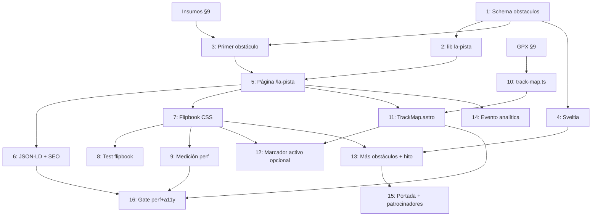

# Implementation Workflow: `/la-pista` — la Pista Carlos Castro, tramo a tramo

- **Fuente**: propuesta acordada en sesión (2026-08-22) a partir del primer clip de los nuevos obstáculos de la pista (`IMG_2455.mov`, 14 s, 1920×1080, HEVC). Decisión del club: **no** se publica como crónica ni como álbum; se construye como página propia `/la-pista`.
- **Estrategia**: incremental — cada fase es desplegable por sí sola vía `develop` → QA → `main`. La Fase 1 (contenido + ficha estática) ya es publicable sin el flipbook.
- **Estado**: planificado, sin ejecutar. Bloqueado por insumos del club (ver §9) para pasar de la Fase 1 a la 2.
- **Cómo retomar con Claude**: `Ejecuta la siguiente tarea pendiente de docs/07-plan-la-pista.md con el modelo asignado` (o `/loop` con ese mismo prompt). Marcar `[x]` al mergear a `develop`.

---

## 0. Lo que ya se sabe de la pista (entrevista a los fundadores, 4-sep-2026)

Fuente: `claudedocs/analisis-entrevista-fundadores-2026-09-04.md` (con verificación externa). Esto ya alcanza para redactar la apertura y la ficha histórica de la Fase 1 sin esperar al club.

- **Dónde**: en el **teatrino del barrio Pizarro**, Yumbo. Carlos Castro lo encontró cubierto de maleza en una salida a trotar, el IMDERTY lo guadañó y él trazó los primeros recorridos; el espacio era zona de rumba y se ganó con unos 12 niños entrenando. El sitio tiene dos direcciones distintas para la pista (`CONTACT.address` y el evento de octubre): confirmar antes del `geo` del JSON-LD.
- **Línea de tiempo**: primeros trazados hacia 2011 · primera válida Copa Valle en 2012 · válida de 2018 con la que la Comisión Nacional de MTB conoció la pista · rediseño con criterio nacional por el diseñador de pistas de la Federación («Pacho») · **subsede del XCO de los Juegos Nacionales 2019** (MinDeporte: 4,2 km) · nuevos ajustes para los **I Juegos Panamericanos Junior 2021** (oro de Martín Vidaurre, campeón mundial sub-23) · circuito de 3,8 km para la válida del 18-oct-2026.
- **Criterio de diseño** (Carlos Castro, 0:37): pistas exigentes «pero cero accidentes»; cada salto lo prueban primero los corredores del club. Es la frase que sostiene la capa pedagógica de cada obstáculo.
- **Infraestructura 2026** (1:23–1:24): baños nuevos, iluminación y seguridad con apoyo de la gestora social, infraestructura e IMDERTY.
- **Quién construye**: el club es «la mano de obra» de los senderos (a pica y pala); el trazado de competencia lo revisa la Comisión. Sirve como `builtBy` genérico mientras no haya dato por obstáculo.
- **Qué sigue bloqueado de §9**: la lista de obstáculos, los clips/fotos por obstáculo, el texto pedagógico por obstáculo, los consentimientos de imagen y el GPX. La historia, el criterio de diseño y el `builtBy` general ya no bloquean.

---

## 1. Concepto

> La página no muestra los saltos: muestra **cómo se aprende a saltarlos**.

`/la-pista` recorre la Pista de Ciclomontañismo Carlos Castro (Yumbo) obstáculo por obstáculo. Cada obstáculo es una **ficha** con tres capas:

1. **El salto, scrubbeado al hacer scroll** — un *flipbook* de 8–12 fotogramas del clip real que avanza con el scroll del lector. Se implementa 100 % en CSS (`animation-timeline`), sin JavaScript ni island, con el mismo patrón de `docs/04-sistema-editorial.md §2.5`.
2. **La capa pedagógica** — qué habilidad entrena (posición de ataque, distribución de peso, lectura de línea), desde qué programa se trabaja y cómo se progresa de forma segura. Es el argumento para la persona *Carolina* (madre que evalúa riesgo) y conecta con `/programas`.
3. **La ficha técnica** — tipo de obstáculo, nivel, fecha de construcción, quién lo construyó.

Arriba, un **mapa de la pista en SVG** (generado en build, como la composición de Trocha Verde) con los obstáculos numerados; abajo, el paso siguiente (`InscriptionCTA` / enlace al programa).

### Lo que se vio en el material de muestra

- Cámara en mano siguiendo a dos corredores del club (jersey Yumbo) bajando un sendero hasta un **cajón de marco verde relleno de grava** (tipo *rock garden* / escalón) al pie de la bajada. Estacas verdes y blancas marcan la línea; el pump track se ve al fondo.
- Una corredora pasa el obstáculo rodando; el otro espera a un lado. Material de entrenamiento técnico — el sitio hoy no tiene ninguna galería con `category: entrenamiento`.
- Formato: HEVC `.mov`. Chrome y Firefox **no** lo reproducen sin transcodificar (ver §6).
- Los menores son identificables → consentimiento de imagen obligatorio antes de publicar (§9).

### Por qué no es crónica ni galería

Una crónica envejece en una semana; la galería ya existe para competencias. La pista es **infraestructura permanente del club**: merece una URL estable, indexable por "pista de ciclomontañismo Yumbo", que crece cada vez que se construye un obstáculo nuevo y que sirve como argumento de venta para familias y patrocinadores.

---

## 2. Arquitectura de la página

Orden de secciones, con el vocabulario del sistema editorial (`SectionShell` → `SectionIntro` → dato → paso siguiente). Alternar `tone` entre secciones consecutivas.

| # | Sección | Componente(s) | `tone` / `pattern` | Dato ilustrado (sale del contenido) |
|---|---------|---------------|--------------------|-------------------------------------|
| 1 | Apertura | `SectionShell` + `SectionIntro` + `Breadcrumb` | `tinted` / `topo` | Bajada con cifras derivadas: nº de obstáculos activos, nº de programas que usan la pista, año de apertura (de `milestones`) |
| 2 | Mapa de la pista | `TrackMap.astro` (SVG build-time) | `plain` / `none` | Trazado + marcadores numerados; lista equivalente en texto (`sr-only` + lista visible en móvil, regla 5 de §3 de 04) |
| 3 | Obstáculos, uno tras otro | `ObstacleCard.astro` × n (cada uno con `ObstacleFlipbook.astro` + ficha) | alterna `muted` / `plain` | Fotogramas, habilidades, programas, fecha |
| 4 | Qué se entrena aquí | `FactGrid` | `tinted` | Habilidades agregadas (conteo por habilidad), niveles cubiertos |
| 5 | Días de pista | reutilizar `WeekRhythm.astro` filtrado a sesiones en la pista | `plain` | Horarios de los programas que referencian la pista |
| 6 | Paso siguiente | `InscriptionCTA` + enlace a `/programas` | `brand` | — |

Reglas que aplican sin excepción (`docs/04-sistema-editorial.md §3`): cero JS nuevo, texto visible en collections, contraste con tokens `-deep`, `labelledby` en cada sección, móvil primero.

### Navegación y descubrimiento

- `src/lib/navigation.ts`: entrada en `SECONDARY_NAV` y en el grupo "El club" del footer (`FOOTER_GROUPS`), entre "Programas" y "Galería".
- Enlaces contextuales: desde `ProgramPathway`/`/programas/formacion-juvenil` (ya menciona los miércoles en la pista), desde `/quienes-somos` y desde la tarjeta de Trocha Verde (la siembra fue alrededor de la pista).
- Sitemap: incluida (no se filtra en `astro.config.mjs`). JSON-LD: generador nuevo `generateTrackJsonLd()` en `src/lib/seo.ts` con `SportsActivityLocation` (nombre, dirección Yumbo, `geo`, `isAccessibleForFree`, `sport: "Mountain biking"`), testeado en `src/lib/__tests__/seo.test.ts`.

---

## 3. Modelo de contenido

### 3.1 Colección nueva `obstaculos`

No se reutiliza `rutas` (su schema es de recorridos con distancia/desnivel). Se crea `obstaculos` en `src/content.config.ts` con loader glob sobre `src/content/obstaculos/**/*.md`; schema centralizado en `src/lib/schemas.ts` y testeado en `schemas.test.ts`.

```ts
// src/lib/schemas.ts — propuesta
export const OBSTACLE_TYPES = [
  'cajon-grava',   // cajón con marco relleno de grava (el del clip de muestra)
  'rock-garden',   // jardín de rocas
  'drop',          // caída / escalón hacia abajo
  'escalon',       // escalón hacia arriba (step-up)
  'tabla',         // tabla / salto de mesa (table top)
  'doble',         // doble
  'peralte',       // curva peraltada (berm)
  'bajada-tecnica',
  'raiz',          // sección de raíces
] as const;

export const OBSTACLE_LEVELS = ['basico', 'intermedio', 'avanzado'] as const;

export const obstaculosSchema = z.object({
  name: z.string(),                                  // "Cajón de grava de la bajada norte"
  type: z.enum(OBSTACLE_TYPES),
  level: z.enum(OBSTACLE_LEVELS),
  summary: z.string().max(180),                      // una frase para tarjeta y mapa
  skills: z.array(z.string()).min(1),                // "Posición de ataque", "Peso atrás"…
  programs: z.array(z.string()).default([]),         // slugs de `programs` (referencia)
  builtOn: z.coerce.date().optional(),
  builtBy: z.string().optional(),                    // "Club + Alcaldía de Yumbo"
  sequence: z.object({
    folder: z.string(),                              // carpeta bajo src/assets/images/la-pista/
    count: z.number().int().min(4).max(16),          // nº de fotogramas 01..NN
    poster: z.number().int().min(1).default(1),      // fotograma visible sin scroll-driven
    alt: z.string(),                                 // descripción del salto para el lector
  }),
  video: z.object({ url: z.url(), title: z.string() }).optional(),  // clip completo (YouTube)
  map: z.object({
    x: z.number().min(0).max(100),                   // % sobre el viewBox del mapa
    y: z.number().min(0).max(100),
  }).optional(),
  order: z.number().default(0),
  active: z.boolean().default(true),
  draft: z.boolean().default(false),
  seo: seoSchema,
});
```

Reglas derivadas en `src/lib/la-pista.ts` (con test): `summarizeTrack()` devuelve `null` si no hay obstáculos activos → la apertura omite las cifras; `skillsByFrequency()` alimenta el `FactGrid`; `programsUsingTrack()` cruza `programs[]` con la colección `programs` y descarta slugs inexistentes **en build** (error claro, no silencio).

El cuerpo markdown del `.md` es la capa pedagógica (2–4 párrafos: qué se aprende, cómo se progresa, qué supervisa el entrenador).

### 3.2 Ejemplo de entrada (el obstáculo del clip de muestra)

```md
---
name: "Cajón de grava de la bajada"
type: "cajon-grava"
level: "intermedio"
summary: "Un escalón relleno de grava al final de una bajada: enseña a mantener el peso atrás y la mirada adelante."
skills: ["Posición de ataque", "Peso atrás en bajada", "Lectura de línea", "Control de frenado"]
programs: ["formacion-juvenil", "alto-rendimiento"]
builtOn: 2026-08-15
builtBy: "Club Deportivo Trocha y Ruta"
sequence:
  folder: "cajon-grava-bajada"
  count: 10
  poster: 6
  alt: "Corredora del club baja por el sendero y pasa rodando el cajón de grava con el peso atrás"
video:
  url: "https://youtu.be/XXXXXXXXXXX"
  title: "Pasando el cajón de grava — entrenamiento técnico"
map: { x: 62, y: 34 }
order: 1
---

Texto pedagógico…
```

### 3.3 Assets

```
src/assets/images/la-pista/
  cajon-grava-bajada/
    01.jpg … 10.jpg     # fotogramas extraídos del clip (1280 px de ancho, JPEG q80)
  mapa/                  # opcional: ortofoto de referencia para dibujar el trazado (no se publica)
```

Resolución en build con `import.meta.glob` (mismo patrón que `src/lib/refresh-images.ts`) → `astro:assets` genera WebP responsive con `width`/`height` explícitos (cero CLS). **No** van a `public/images/`: perderían la optimización.

Extracción de fotogramas: el script del Apéndice A (AVFoundation, sin ffmpeg; probado en esta máquina con el clip de muestra). Alternativa si se decide alojar el video en Cloudinary: `.../video/upload/so_<segundos>,w_1280/<id>.jpg` extrae el fotograma por URL.

### 3.4 Sveltia CMS

Agregar colección `obstaculos` a `public/admin/config.yml` (label "La pista — obstáculos"), con `media_folder: "/src/assets/images/la-pista"`, `type`/`level` como `select` con las mismas opciones del enum, `programs` como `relation` a `programs`, y `sequence` como `object`. Mantener en sync con el schema Zod (regla del proyecto).

---

## 4. Mecánica del flipbook (CSS puro)

Patrón: **escena alta + escenario pegajoso + fotogramas apilados**. Mientras el lector hace scroll por la escena, el escenario se queda fijo y los fotogramas se revelan uno a uno.

```html
<!-- ObstacleFlipbook.astro (esquema) -->
<figure class="flipbook-scene" style={`--n:${count}`}>
  <div class="flipbook-stage">
    {frames.map((img, i) => (
      <Image
        src={img} alt={i === poster - 1 ? alt : ''}
        widths={[480, 768, 1024, 1280]} sizes="(min-width: 1024px) 960px, 100vw"
        loading={i === poster - 1 ? 'eager' : 'lazy'} decoding="async"
        class="flipbook-frame" style={`--i:${i}`}
        data-poster={i === poster - 1 ? '' : undefined}
      />
    ))}
  </div>
  <figcaption class="sr-only">{alt}</figcaption>
</figure>
```

```css
/* global.css — junto a .timeline-progress / .sda-parallax-* */
.flipbook-scene { position: relative; height: 220svh; view-timeline-name: --flipbook; }
.flipbook-stage { position: sticky; top: var(--header-offset, 0px); aspect-ratio: 16 / 9; overflow: clip; }
.flipbook-frame { position: absolute; inset: 0; opacity: 0; }
.flipbook-frame[data-poster] { opacity: 1; }          /* estado final visible sin soporte */

@media (prefers-reduced-motion: no-preference) {
  @supports (animation-timeline: view()) {
    .flipbook-scene { --supported: 1; }
    .flipbook-frame[data-poster] { opacity: 0; }
    .flipbook-frame[style*="--i:0"] { opacity: 1; }   /* el primero siempre visible */
    .flipbook-frame {
      animation-name: flipbook-reveal;
      animation-timing-function: steps(1, jump-start);
      animation-fill-mode: both;
      animation-timeline: --flipbook;
      animation-range: contain calc(var(--i) * 100% / var(--n))
                       contain calc((var(--i) + 1) * 100% / var(--n));
    }
    @keyframes flipbook-reveal { from { opacity: 0 } to { opacity: 1 } }
  }
}
```

Cómo funciona: los fotogramas están apilados en orden DOM, así que el último que se haya "encendido" tapa a los anteriores. Cada fotograma `i` se enciende (`steps(1, jump-start)`) al entrar en su tramo de la escena y se queda encendido (`fill-mode: both`). Al subir, las animaciones scroll-driven retroceden solas. Sin soporte o con *reduced motion*, todos quedan apagados salvo el `poster`.

Sin escena alta (variante compacta para móvil angosto o tarjetas): `height: auto` y `animation-timeline: view()` sobre el propio escenario con `animation-range: cover …`; el flipbook corre mientras la tarjeta cruza el viewport.

**Gotchas heredados de 04 §2.5 y de `global.css`:**

1. Longhands siempre: Lightning CSS descarta la regla si `view()`/un timeline con nombre va dentro del shorthand `animation`.
2. Ningún ancestro con `overflow: hidden` entre la escena y el viewport; `SectionShell` con `scrollDriven` (usa `overflow-clip`).
3. `view-timeline-name` lo ven los descendientes; si el escenario se saca de la escena, hace falta `timeline-scope`.
4. Solo se anima `opacity`. Nada de `filter`, `width` ni `top`.
5. `--header-offset`: si el header es pegajoso, el escenario debe quedar debajo de él (token a definir al ejecutar la tarea 7).

**Presupuesto**: 10 fotogramas × ~45 KB (WebP 1024 px) ≈ 450 KB por obstáculo, todos `lazy` salvo el `poster`. El clip completo **no** se embebe en la página: se enlaza a YouTube (sin iframe, sin JS) con UTM (`docs/05-convencion-utm.md`).

---

## 5. Mapa de la pista

`TrackMap.astro`: SVG inline generado en build con el trazado de la pista y un marcador numerado por obstáculo (`map.x`, `map.y` en % del `viewBox`). Cada marcador es un `<a href="#obstaculo-<slug>">` con `aria-label`; debajo del mapa, la lista numerada en texto (la que se usa en móvil, donde las etiquetas no caben).

Origen del trazado, por orden de preferencia:

1. **GPX de una vuelta** grabada con Strava/Garmin → `src/data/la-pista.gpx` → `src/lib/track-map.ts` lo proyecta y normaliza a un `path` (con test). Así el trazado es dato, no dibujo.
2. Si no hay GPX: `path` dibujado a mano sobre una ortofoto, guardado como constante en `src/lib/track-map.ts`.

Estilo: curvas de nivel `topo` del sistema editorial de fondo, trazo `primary`, marcadores `accent` con texto `surface-dark` (contraste), mismo `uid` de `defs` que usa `src/lib/editorial.ts`.

---

## 6. Video: formato y alojamiento

| Opción | Uso | Notas |
|--------|-----|-------|
| **YouTube (no listado)** | Clip completo enlazado desde la ficha | Patrón ya usado en el sitio. Sin iframe en la página (peso y CSP); solo enlace con UTM |
| Cloudinary video | Alternativa si se quiere `<video>` propio | Transcodifica HEVC → H.264/WebM con `f_auto,q_auto`; extrae fotogramas con `so_`. Consume créditos del plan |
| `<video>` en `public/` | Descartado | 21 MB por clip, sin transcodificación, rompe el presupuesto |

El `.mov` original es HEVC: **siempre** transcodificar antes de cualquier uso web. Los clips que se graben de ahora en adelante: 10–20 s, cámara **fija** en un trípode o apoyada (el flipbook queda limpio si el fondo no se mueve), horizontal 16:9, un solo corredor en cuadro.

---

## 7. Requisitos no funcionales (innegociables)

- Lighthouse ≥ 95, LCP < 2.0 s, INP < 200 ms, CLS < 0.05. El LCP de la página es la imagen `poster` del primer obstáculo o la ilustración de apertura: `loading="eager"`, dimensiones explícitas.
- Cero JavaScript nuevo; cero islands nuevas. Si algo "necesita" JS, se replantea.
- WCAG 2.1 AA: `figcaption` con la descripción del salto, marcadores del mapa navegables por teclado, contraste con tokens `-deep`, estado final visible con `prefers-reduced-motion: reduce`.
- Contenido visible en español colombiano desde las collections; identificadores en inglés.
- Ley 1098 / consentimiento de imagen: ningún menor identificable sin autorización firmada (`legal-compliance-officer` valida antes de la Fase 2).

---

## 8. Fases y tareas

Convenciones: `Sonnet` para trabajo bien especificado; `Opus` para decisiones de diseño, SVG del sistema editorial o integración delicada. Antes de tocar secciones: leer `docs/04-sistema-editorial.md`.

### Fase 1 — Contenido y ficha estática (1 día) — publicable sin flipbook

| # | Tarea | Modelo | Agente | Archivos | Depende de | Complejidad | Riesgo |
|---|-------|--------|--------|----------|------------|-------------|--------|
| 1 | `[ ]` Schema `obstaculosSchema` + enums `OBSTACLE_TYPES`/`OBSTACLE_LEVELS` + colección en `content.config.ts` + tests de schema | Sonnet | content-manager | `src/lib/schemas.ts`, `src/content.config.ts`, `src/lib/__tests__/schemas.test.ts` | — | Baja | Bajo |
| 2 | `[ ]` Lógica derivada `src/lib/la-pista.ts` (`summarizeTrack`, `skillsByFrequency`, `programsUsingTrack`, labels/colores por tipo y nivel) con tests; `null` cuando no hay datos | Sonnet | astro-dev | `src/lib/la-pista.ts`, `src/lib/__tests__/la-pista.test.ts` | 1 | Media | Bajo |
| 3 | `[ ]` Primer obstáculo: extraer 10 fotogramas del clip de muestra (Apéndice A), escribir `cajon-grava-bajada.md` con capa pedagógica revisada por el entrenador | Sonnet | content-marketer + photo-video-editor | `src/content/obstaculos/`, `src/assets/images/la-pista/cajon-grava-bajada/` | 1, insumos §9 | Baja | Medio — consentimiento de imagen |
| 4 | `[ ]` Sveltia: colección `obstaculos` en `config.yml` en sync con el schema | Sonnet | content-manager | `public/admin/config.yml` | 1 | Baja | Bajo |
| 5 | `[ ]` Página `/la-pista` con apertura, `ObstacleCard` (ficha + poster estático, aún sin flipbook), `FactGrid` de habilidades, `WeekRhythm` filtrado y CTA; navegación (`SECONDARY_NAV`, footer) y enlaces contextuales desde programas/quiénes somos | **Opus** | astro-dev | `src/pages/la-pista.astro`, `src/components/sections/ObstacleCard.astro`, `src/lib/navigation.ts`, `ProgramPathway.astro` | 2, 3 | Alta | Medio — primera página nueva con el sistema editorial desde cero |
| 6 | `[ ]` SEO: `generateTrackJsonLd()` (`SportsActivityLocation`) + test; `SEOHead` con OG del poster; verificar inclusión en sitemap | Sonnet | seo-auditor | `src/lib/seo.ts`, `src/lib/__tests__/seo.test.ts`, `src/pages/la-pista.astro` | 5 | Baja | Bajo |

### Fase 2 — Flipbook scroll-driven (1 día)

| # | Tarea | Modelo | Agente | Archivos | Depende de | Complejidad | Riesgo |
|---|-------|--------|--------|----------|------------|-------------|--------|
| 7 | `[ ]` `ObstacleFlipbook.astro` + utilidades `.flipbook-*` en `global.css` (§4), token `--header-offset`, `SectionShell scrollDriven` en la sección de obstáculos; variante compacta sin escena alta | **Opus** | astro-dev | `src/components/sections/ObstacleFlipbook.astro`, `src/styles/global.css`, `ObstacleCard.astro` | 5 | Alta | Medio — longhands obligatorios; `overflow` de ancestros; Lightning CSS |
| 8 | `[ ]` Test del componente con el contenedor de Astro: renderiza `count` fotogramas, solo el `poster` con `alt` no vacío y `eager`, `figcaption` presente, `--n`/`--i` correctos | Sonnet | astro-dev | `src/components/sections/__tests__/ObstacleFlipbook.astro.test.ts` | 7 | Baja | Bajo |
| 9 | `[ ]` Medición: peso por obstáculo ≤ 500 KB lazy, LCP del poster, CLS 0 con sticky; comprobar en Chrome, Safari y Firefox (sin soporte → poster) y con `prefers-reduced-motion: reduce` | Sonnet | performance-engineer + qa-auditor | — | 7 | Media | Bajo |

### Fase 3 — Mapa de la pista (½–1 día)

| # | Tarea | Modelo | Agente | Archivos | Depende de | Complejidad | Riesgo |
|---|-------|--------|--------|----------|------------|-------------|--------|
| 10 | `[ ]` `src/lib/track-map.ts`: parseo GPX → proyección → `path` normalizado a `viewBox` (o constante dibujada si no hay GPX) + test | Sonnet | astro-dev | `src/lib/track-map.ts`, `src/data/la-pista.gpx`, `src/lib/__tests__/track-map.test.ts` | insumo GPX §9 | Media | Bajo |
| 11 | `[ ]` `TrackMap.astro`: SVG build-time con trazado, marcadores `<a>` numerados y lista equivalente; textura `topo` y `uid` de `editorial.ts`; integración en la página | **Opus** | astro-dev | `src/components/sections/TrackMap.astro`, `src/pages/la-pista.astro` | 10, 5 | Alta | Medio — SVG del sistema editorial, contraste de marcadores, móvil |
| 12 | `[ ]` (Opcional) Marcador que se ilumina al scroll cuando su obstáculo está en pantalla — solo si sale en CSS puro (`timeline-scope` + named view timelines); si exige JS, se descarta | **Opus** | astro-dev | `TrackMap.astro`, `global.css` | 11, 7 | Alta | Medio |

### Fase 4 — Crecimiento (cuando haya más obstáculos)

| # | Tarea | Modelo | Agente | Archivos | Depende de | Complejidad | Riesgo |
|---|-------|--------|--------|----------|------------|-------------|--------|
| 13 | `[ ]` Cargar los demás obstáculos desde el CMS (un `.md` + carpeta de fotogramas por cada uno); hito en `milestones` "2026 — nuevos obstáculos técnicos" | Sonnet | content-manager + photo-video-editor | `src/content/obstaculos/`, `src/content/milestones/` | 4, 7 | Baja | Bajo |
| 14 | `[ ]` Evento de analítica `track_video_click` (param `content_id` = slug) en el enlace al clip completo — declarar en `EVENT_NAMES`/whitelist; sin PII | Sonnet | data-analyst | `src/lib/events.ts`, `ObstacleCard.astro` | 5 | Baja | Bajo |
| 15 | `[ ]` Tarjeta de `/la-pista` en la portada y en `/patrocinadores` si una empresa o la Alcaldía aportó a la obra (crédito `builtBy`) | Sonnet | astro-dev + sponsor-relations-lead | `src/pages/index.astro`, `src/pages/patrocinadores.astro` | 13 | Baja | Bajo |

### Gate final (tras cada fase, obligatorio antes de `main`)

| # | Tarea | Modelo | Agente | Depende de |
|---|-------|--------|--------|------------|
| 16 | `[ ]` Auditoría: Lighthouse ≥ 95, CLS < 0.05, INP < 200 ms; barrido con `prefers-reduced-motion: reduce` y en Firefox (poster visible, nada oculto); teclado y lector de pantalla en mapa y flipbook; `npm run test:run` + `npm run typecheck` | **Opus** (revisión) | qa-auditor + accessibility-tester | fase correspondiente |

---

## 9. Insumos que debe aportar el club (bloquean la Fase 1 → 2)

- [ ] **Lista de obstáculos**: nombre, tipo (de `OBSTACLE_TYPES`; si falta uno, se agrega al enum), nivel, desde qué programa se trabaja.
- [ ] **Por obstáculo**: un clip de 10–20 s con cámara fija (horizontal, un corredor) y 2–3 fotos. El clip de muestra sirve para el primer obstáculo aunque la cámara se mueva.
- [ ] **Texto pedagógico** del entrenador (qué se aprende, cómo se progresa, qué se supervisa) — 2–4 párrafos por obstáculo. Puede ser audio/WhatsApp; `content-marketer` lo redacta.
- [ ] **Quién construyó y cuándo** cada obstáculo (para `builtBy`/`builtOn`, el hito y los créditos a patrocinadores).
- [ ] **Consentimientos de imagen** firmados de los menores que aparecen (`legal-compliance-officer` verifica).
- [ ] **GPX de una vuelta a la pista** (Strava/Garmin) para el mapa; si no, una ortofoto/captura satelital para dibujar el trazado a mano.
- [ ] **Dirección y coordenadas** de la pista para el JSON-LD.
- [ ] URL del clip completo en YouTube (no listado está bien).

---

## 10. Grafo de dependencias



---

## 11. Registro de riesgos

| Riesgo | Tareas | Mitigación |
|--------|--------|-----------|
| Menores identificables sin consentimiento | 3, 13 | Validación legal antes de subir fotogramas; si falta firma, se usa un obstáculo vacío o un adulto |
| Lightning CSS descarta `animation-timeline` en shorthand | 7 | Longhands siempre; verificar en `dist/` que la regla sobrevive |
| Ancestro con `overflow: hidden` congela el flipbook | 7 | `SectionShell scrollDriven`; test visual en `develop` |
| Escena alta (`220svh`) hace la página muy larga con muchos obstáculos | 7, 13 | Variante compacta a partir del 4.º obstáculo o en viewport < 640 px; medir scroll-depth |
| Peso total con 6+ obstáculos (≈ 3 MB lazy) | 9, 13 | `loading="lazy"` salvo poster; tope de 12 fotogramas; WebP 1024 px máx. |
| Firefox estable sin scroll-driven animations | 7 | Resuelto por diseño: poster visible; enlace al clip completo siempre presente |
| Cámara en mano → fotogramas que "bailan" | 3 | Aceptable para el primero; protocolo de grabación con cámara fija para los siguientes (§6) |
| Trazado del mapa sin GPX | 10 | Constante dibujada a mano; reemplazable por GPX sin tocar el componente |
| HEVC no reproducible en Chrome/Firefox | 6 | Nunca enlazar el `.mov`; transcodificar vía YouTube/Cloudinary |

---

## 12. Recomendaciones de ejecución

- **MVP entregable**: Fase 1 completa (tareas 1–6) ya publica `/la-pista` con el primer obstáculo y su ficha; el flipbook (Fase 2) es la capa de deleite y cae bien como entrega de la Fase 4 de `docs/06-plan-animaciones.md` (comparte utilidades y gotchas).
- **Paralelizable**: tras la tarea 5, las Fases 2 y 3 son independientes; 10 puede empezar en cuanto haya GPX, sin esperar a 7.
- **Mayor riesgo primero**: 7 y 11 en branch propio con QA en `develop` antes de mezclar.
- Flujo de ramas: feature branch → `develop` (QA con environment develop) → `main`.
- Antes de ejecutar la tarea 5, releer `docs/04-sistema-editorial.md` y usar `/programas` como referencia de página.

---

## Apéndice A — Extracción de fotogramas sin ffmpeg (macOS)

Probado el 2026-08-22 con el clip de muestra en macOS 15 (AVFoundation; la API `copyCGImage` está *deprecated* pero funciona). Guardar como `scripts/extract-frames.swift` al ejecutar la tarea 3.

```swift
import AVFoundation
import AppKit

// Uso: swift scripts/extract-frames.swift <video> <carpeta-salida> [n=10] [ancho=1280]
let url = URL(fileURLWithPath: CommandLine.arguments[1])
let outDir = CommandLine.arguments[2]
let n = CommandLine.arguments.count > 3 ? Int(CommandLine.arguments[3]) ?? 10 : 10
let width = CommandLine.arguments.count > 4 ? Int(CommandLine.arguments[4]) ?? 1280 : 1280

let asset = AVURLAsset(url: url)
let duration = CMTimeGetSeconds(asset.duration)
let generator = AVAssetImageGenerator(asset: asset)
generator.appliesPreferredTrackTransform = true
generator.maximumSize = CGSize(width: width, height: width)
generator.requestedTimeToleranceBefore = .zero
generator.requestedTimeToleranceAfter = .zero

for i in 0..<n {
  let seconds = duration * (Double(i) + 0.5) / Double(n)
  let time = CMTime(seconds: seconds, preferredTimescale: 600)
  do {
    let cgImage = try generator.copyCGImage(at: time, actualTime: nil)
    let rep = NSBitmapImageRep(cgImage: cgImage)
    let data = rep.representation(using: .jpeg, properties: [.compressionFactor: 0.8])!
    let name = String(format: "%02d.jpg", i + 1)
    try data.write(to: URL(fileURLWithPath: "\(outDir)/\(name)"))
    print("\(name) @ \(String(format: "%.2f", seconds))s")
  } catch {
    print("error en fotograma \(i + 1): \(error)")
  }
}
```

Recomendación: recortar antes el clip al tramo del salto (2–4 s) con QuickTime (Edición → Recortar) para que los `n` fotogramas cubran solo la acción y no la aproximación. Con `ffmpeg` disponible (`brew install ffmpeg`), equivalente: `ffmpeg -ss 5 -t 3 -i clip.mov -vf "fps=10/3,scale=1280:-1" -q:v 3 %02d.jpg`.

## Apéndice B — Material de muestra

- `~/Downloads/IMG_2455.mov` — 14,07 s, 1920×1080, HEVC, 20,9 MB. Tramo útil para el flipbook: ≈ 5,5 s – 9 s (aproximación y paso del cajón de grava).
